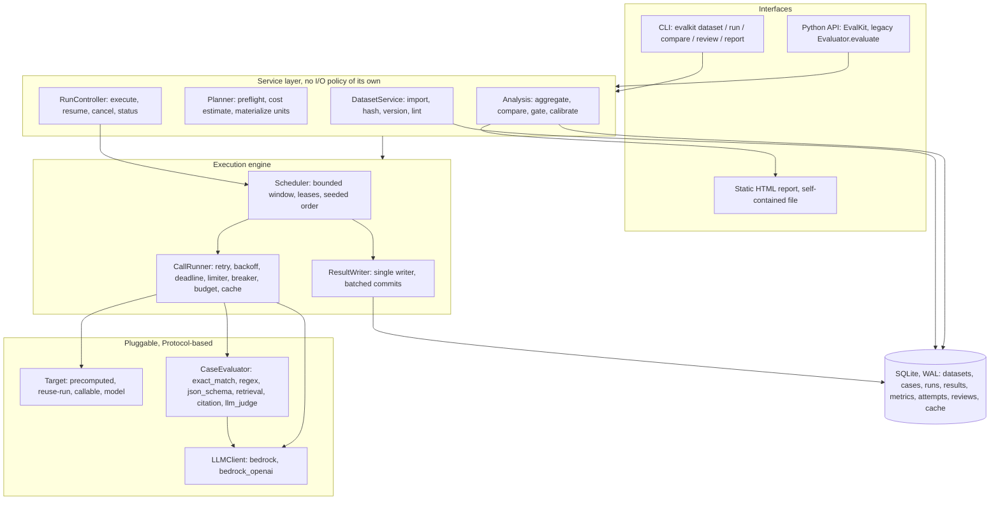
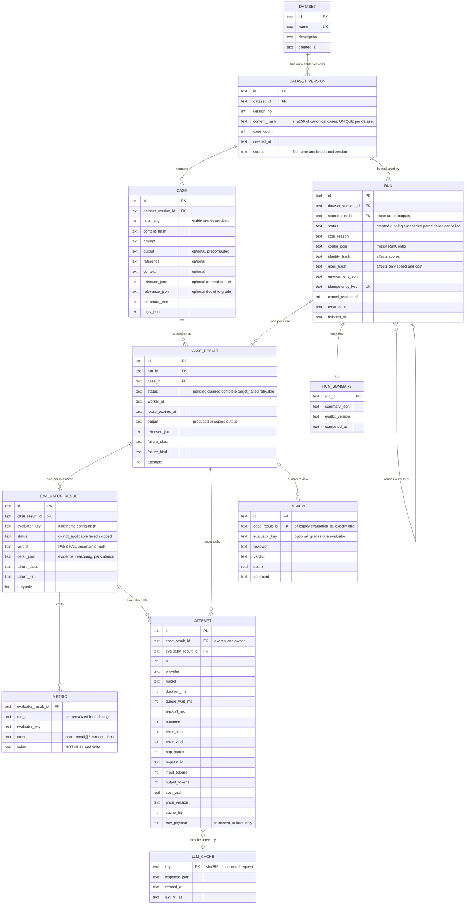
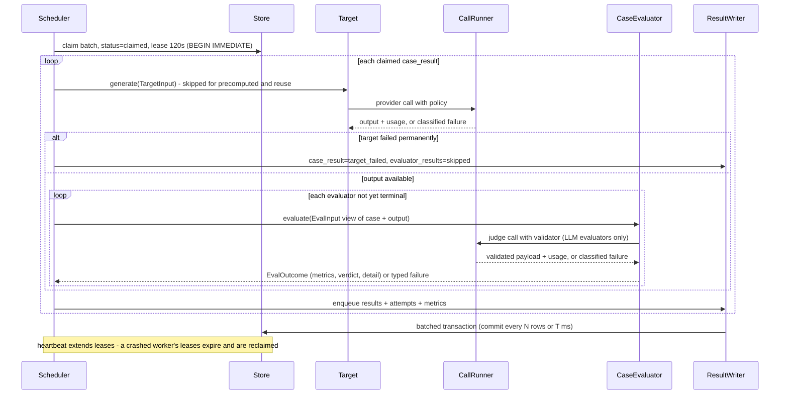
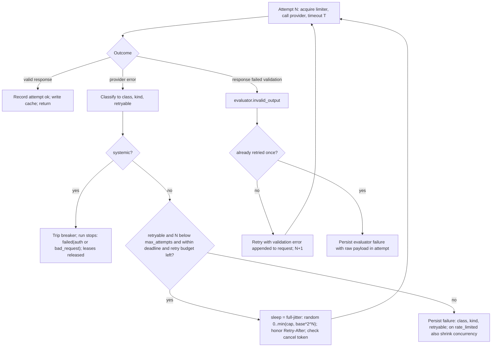
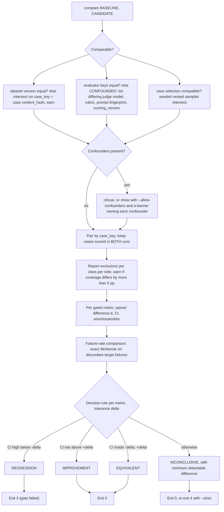

# EvalKit — Target Architecture (Phase 2)

Status: **design only, nothing implemented.** Source of truth for current behavior:
[`PRODUCTION-AUDIT.md`](PRODUCTION-AUDIT.md) (audited at `99d8def`). Finding IDs (`F-n`) and
section numbers (`§n` in the audit) are referenced throughout.

Product story this design serves:

> EvalKit lets engineering teams systematically evaluate AI systems, compare
> models/prompts/pipelines, detect regressions, understand failures, and make
> quality/cost/latency decisions using reproducible evaluation runs.

Contents: [1 Principles](#1-principles-and-non-goals) · [2 Architecture](#2-high-level-architecture) ·
[3 Domain model](#3-domain-model) · [4 Execution flow](#4-execution-flow-and-lifecycle) ·
[5 Targets](#5-targets) · [6 Evaluators](#6-evaluators) · [7 Failure taxonomy](#7-failure-taxonomy) ·
[8 Reliability](#8-reliability-engine) · [9 Metrics, comparison, trust](#9-metrics-aggregation-comparison-and-judge-trust) ·
[10 Reproducibility](#10-reproducibility) · [11 Storage](#11-storage-and-migrations) ·
[12 Observability](#12-observability) · [13 Interfaces and UI](#13-interfaces-and-ui-decision) ·
[14 Security](#14-security-and-untrusted-input) · [15 Scaling](#15-scaling-100--10k--1m) ·
[16 Decision records](#16-decision-records) · [17 Required questions](#17-direct-answers-to-the-required-questions) ·
[18 Out of scope](#18-deliberately-out-of-scope) · [19 Roadmap](#19-implementation-roadmap) ·
[20 Risks](#20-risks-and-open-questions) · [21 Summary](#21-summary)

---

## 0. Traceability: audit finding → design response

| Audit finding | Design response | Where | Roadmap |
|---|---|---|---|
| F-1 NaN/inf scores persisted as ok | `allow_inf_nan=False` everywhere, finite-result invariant, DB CHECKs | §6.5, §11 | P0 |
| F-2 attempt history / raw evidence discarded | `attempts` table: every provider call, incl. failed & rejected payloads | §3, §11 | P0 (JSON col), P1 (table) |
| F-3 no migrations, positional INSERT | versioned migration runner, named columns, legacy detection | §11 | P0 |
| F-4 lossy `_escape` | nonce-delimited raw content (injective) | §6.4, §14 | P0 |
| F-5 flat provider errors, no backoff | taxonomy with `retryable`, central `RetryPolicy` | §7, §8 | P1/P2 |
| F-6 tokens/cost/request-id discarded | `LLMResponse.usage`, `attempts` columns, price table | §3, §8.7 | P1 |
| F-7 rubric version reuse | `rubric_versions` uniqueness check / content-hash identity | §10, §11 | P0 |
| F-8 single judge, weighted-mean masking | must-pass criteria (`gate`), trust stack | §6.3, §9.6 | P1 |
| F-9 no system under test | `Target` (optional) with `precomputed` as the default kind | §5 | P1 |
| F-10 no input size limits | limits enforced at import and API boundary | §14 | P0 |
| F-11 no logging | structured logs + attempts-as-spans + metrics | §12 | P1/P2 |
| F-12 `list(limit)` variable overflow | keyset pagination, validated limit | §11 | P0 |
| F-13 paid result lost on store failure | spill-file fallback, `StoreError.result` | §8.9 | P0 |
| F-14 no idempotency/cache | unit uniqueness + response cache + import idempotency | §8.6 | P2 |
| Weakness 1–2 (no run, case/result conflated) | Dataset/Case/Run/CaseResult/EvaluatorResult split | §3 | P1 |
| Weakness 3 (failure = string) | `FailureClass × kind × retryable` as data | §7 | P1 |
| Weakness 6–7 (Evaluator overloaded, retry embedded) | service layer + `CallRunner` | §2, §8 | P1 |
| Audit §11 `PROMPT_VERSION` misses render logic | golden-render fingerprint | §6.4 | P0 |
| Audit §19 no evaluation-of-evaluator | `judge-check`, stats simulation tests | §9.6, §19 | P1 |

---

## 1. Principles and non-goals

1. **Dataset-first.** The unit of evaluation is a versioned dataset of cases; scoring pre-generated
   outputs is the core path. Running a target is an *option* that produces the same thing
   (an output) by another route.
2. **Trust is a feature.** Every number in a report carries its denominator, its failure
   attribution, and its uncertainty. No single judge is authoritative.
3. **Deterministic core, effects at the edges.** Scoring, aggregation, comparison and
   classification are pure functions over stored data; provider calls, clocks, and DB are injected.
4. **Blame is data.** A failure is attributed to target / evaluator / infrastructure / input
   at the moment it happens, with retry and accounting consequences fixed by that class.
5. **Immutability where comparison depends on it.** Dataset versions, run configs and
   results are append-only; "what did we actually measure?" is always answerable.
6. **Smallest thing that scales credibly.** One process, threads, SQLite (WAL) by default;
   the seams (`Store`, `LLMClient`, `Target`, leases) are where scale-out would attach. Nothing
   is built for a scale requirement that has not been demonstrated.
7. **Preserve what works** (audit §26): transport-only providers, strict non-coercing
   validation, scoring in Python, typed errors, full input snapshots, SDK retries off,
   SQLite, argparse CLI.

Non-goals are consolidated in [§18](#18-deliberately-out-of-scope).

---

## 2. High-level architecture



### 2.1 Dependency rules (enforced by an import test, see P1)

```
domain  ←  evaluators, targets, llm, analysis  ←  engine  ←  service  ←  cli / public API
domain  ←  store      (store implements Protocols defined in domain; nothing imports store except service/engine wiring)
```

- `domain` (models, errors/taxonomy, `RunConfig`, hashing, scoring math) imports **nothing** from the
  rest of the package and does no I/O. This is the "deterministic core".
- `analysis` (aggregation, paired statistics, calibration) is pure: rows in, numbers out.
- SDK imports remain confined to `llm/bedrock.py` and `llm/bedrock_openai.py` (audit §2, kept).

### 2.2 Package layout

The original spec mandated a flat layout; ~9 modules were right for 1,000 lines, ~30 are not.

```
src/evalkit/
  domain/      models.py  errors.py  config.py  hashing.py  scoring.py(Rubric.score lives here)
  evaluators/  base.py  llm_judge.py  exact.py  regex.py  json_schema.py  retrieval.py  citation.py
  targets/     base.py  precomputed.py  reuse.py  callable.py  model.py
  llm/         client.py  bedrock.py  bedrock_openai.py  pricing.py  prompts.py
  engine/      scheduler.py  call_runner.py  retry.py  limits.py  cancel.py  writer.py
  analysis/    aggregate.py  compare.py  calibrate.py  report.py
  store/       protocol.py  sqlite.py  migrations/0001_*.sql ...
  service.py   cli.py   __init__.py
  # compatibility shims kept: evalkit.bedrock, evalkit.bedrock_openai, evalkit.judge,
  # evalkit.models, evalkit.store, evalkit.errors  (re-export; existing imports keep working)
```

Naming decision: the existing class `Evaluator` (single-record facade: `evaluate/get/list/review`)
keeps its name and behavior for compatibility. The new per-case scoring interface is
**`CaseEvaluator`** to avoid two things called `Evaluator`.

---

## 3. Domain model



### 3.1 Entities

| Entity | Definition | Invariants |
|---|---|---|
| **Dataset** | Named collection lineage (`support-qa`). | name unique. |
| **DatasetVersion** | Immutable snapshot. `content_hash = sha256(canonical JSONL of cases sorted by case_key)`. | Re-importing identical content returns the existing version (idempotent). Rows never updated after insert. |
| **EvaluationCase** | One input plus everything *any* evaluator may need: `prompt`, optional `output` (pre-generated), `reference`, `context`, `retrieved` (ordered doc IDs), `relevance` (doc ID → grade), `metadata`, `tags`. `case_key` is the stable identity across versions; `content_hash` detects change. | `case_key` unique within a version. Size-limited (§14). Every float finite. |
| **RunConfig** | Frozen, hashable spec of *what* is measured (dataset version, target spec, evaluator specs, case selection) and *how* it executes (concurrency, retry, limits, budget, gates). Persisted verbatim. | Two hashes: `identity_hash` (things that change scores) and `exec_hash` (things that only change speed/cost). |
| **EvaluationRun** | One execution of a `RunConfig` over a `DatasetVersion`. | Config immutable after creation. `resume` requires identical `identity_hash`. |
| **CaseResult** | The target stage for one case in one run: the output actually evaluated (produced, precomputed, or borrowed from `source_run_id`), target failure if any, lease state. | UNIQUE(run_id, case_id). |
| **EvaluatorResult** | One evaluator's outcome for one case result: status, verdict, evidence (`detail_json`), failure attribution. | UNIQUE(case_result_id, evaluator_key). |
| **Metric** | One named finite number from an evaluator result (`score`, `criterion.correctness`, `recall@5`, `mrr`, `ndcg@10`). Normalized rows so aggregation is SQL, not JSON parsing. | `value` NOT NULL, finite. |
| **Attempt** | One provider/target call, successful or not: timing split, tokens, cost, request ID, error classification, truncated raw payload for failures. | Exactly one owner. Cost and latency are sums over attempts (failed attempts cost money too). |
| **Review** | Human judgment on a case result, optionally grading a specific `evaluator_key`. | Append-only. Legacy `evaluations` reviews stay valid (CHECK exactly one subject). |
| **RunSummary** | Immutable snapshot of aggregates at completion, tagged with EvalKit version; always recomputable from rows. | — |

### 3.2 Answers folded into the model

- **Case vs. Result separation.** A case is *data* (immutable, versioned); results are *facts
  about an execution* (per run, per evaluator). Consequences: the same case can be scored by N
  evaluators (N `EvaluatorResult` rows, independent failures); the same dataset can be re-run
  with any target (new run, same `dataset_version_id`); outputs can be re-scored with a new rubric
  without re-running the target (a new run with `source_run_id`, §5.3); dataset changes never rewrite history.
- **Legacy path.** `evaluations`/`reviews` and `Evaluator.evaluate()` remain as the ad-hoc,
  one-record API ([D14](#d14-legacy-single-record-api-stays)). They are not migrated into runs;
  reviews gain an alternative subject (`case_result_id`).

### 3.3 Identity and hashing rules

> **Implementation notes (dataset foundation, implemented).** Where the shipped code is more
> specific than, or differs slightly from, the text below:
> - `DatasetVersion.content_hash` is `sha256("evalkit-dataset-v1\n" + "<case_key>\t<case_hash>\n"...)`
>   over cases in ascending `case_key` (byte order), where `case_hash = sha256("evalkit-case-v1\n" +
>   canonical JSON of the case content)`. It commits to the same information as "canonical JSONL of
>   sorted cases" but is streamable (SQL supplies the order; no re-serialization). Case hashes
>   exclude `case_key`, treat `None` and `""` as different, sort `tags`, and keep `retrieved` order.
>   The domain strings are versioned: a scheme change is a new domain, never an edit.
> - A version row is inserted `sealed=0`, filled, then sealed with its hash/count **in the same
>   transaction**; triggers make sealed versions and all cases immutable (UPDATE/DELETE aborted,
>   INSERT into a sealed version aborted). Committed versions are therefore always sealed.
> - `cases` has no `ordinal` (order is `case_key`); the case field is named `reference` (not
>   `reference_output`); unknown fields are refused. Import is atomic: nothing, not even the dataset
>   row, survives an invalid or empty input; identical content returns the existing version.
> - Refs: `name`, `name@latest`, `name@<n>`, `name@<8+ hex hash prefix>`.
> - `evalkit.EvalKit` (`.datasets` only, so far) is the entry point; lint currently reports
>   `duplicate_content`, `duplicate_prompt`, `empty_output`, `empty_reference`,
>   `mixed_output_presence`, `retrieved_without_relevance`.

- Canonical JSON: sorted keys, UTF-8, no NaN/Infinity, floats via `repr`.
- `evaluator_key = f"{kind}:{name}:{h12}"`, `h12 = sha256(canonical(params, rubric, judge model,
  temperature, max_tokens, judge_prompt_fingerprint, scoring_version))[:12]`. Any change that can
  change a score changes the key, so results with different keys are **never silently compared**.
- `identity_hash = sha256(dataset_version.content_hash, case_selection, target.identity,
  sorted(evaluator_keys), scoring_version)`.
- `exec_hash = sha256(policy)` (concurrency, limits, retry, budget). Excluded from comparison identity.
- `scoring_version`: an integer constant in `domain/scoring.py`, bumped whenever normalization,
  aggregation or verdict logic changes; it closes the audit's "logic changed, version didn't" gap.

---

## 4. Execution flow and lifecycle

### 4.1 Data flow

```mermaid
flowchart LR
    F["cases.jsonl"] -->|"stream, validate, limit, hash"| DV["DatasetVersion, immutable"]
    DV --> R["EvaluationRun, RunConfig pinned"]
    R -->|"materialize units, seeded order"| CRs["CaseResult per case"]
    CRs --> T{"Target kind"}
    T -->|precomputed| O1["output from case"]
    T -->|reuse run| O2["output from source run"]
    T -->|"callable / model"| O3["generate: latency, tokens, cost"]
    O1 --> E
    O2 --> E
    O3 --> E
    E["Evaluators, independent of each other"] --> ER["EvaluatorResult + Metrics + Attempts"]
    ER --> AG["Aggregate: denominators, failure counts, CIs"]
    AG --> CMP["Compare two runs, gate, report"]
    ER --> HQ["Review queue: uncertain, disagreement, random sample"]
    HQ --> CAL["Calibration: judge vs human"]
    CAL --> AG
```



### 4.2 Run lifecycle

```mermaid
stateDiagram-v2
    [*] --> created: RunConfig frozen, preflight passed
    created --> running: execute
    running --> succeeded: all units terminal and coverage at least min_coverage
    running --> partial: budget, deadline, or breaker stop; retryable units remain
    running --> cancelled: cancel requested, in-flight drained
    running --> failed: systemic failure, e.g. auth or bad judge config
    partial --> running: resume
    cancelled --> running: resume
    failed --> running: resume after fix
    succeeded --> [*]
```



`created` is only reachable if **preflight** passed (§4.4). `partial`, `cancelled` and `failed`
all keep every completed result and are resumable; the difference is *why* the run stopped
(`runs.stop_reason`).

### 4.3 Unit-of-work lifecycle (one case)



### 4.4 Preflight (input/dataset failures caught before spending)

1. **Schema/limits:** every case validated; oversize/invalid → `input.*` issues.
2. **Evaluator requirements:** each evaluator declares required case fields (e.g. `retrieval`
   needs `retrieved` + `relevance`; `exact_match` needs `reference`). Cases lacking them are
   reported *per evaluator*; policy `on_missing = abort (default) | not_applicable`.
3. **Dataset lint (warnings):** duplicate prompts, duplicate keys, empty outputs/references,
   label imbalance, `n` too small for the gates configured.
4. **Contamination check:** a `model` target's prompt template must not contain any case
   `prompt`/`reference` verbatim (few-shot leakage from the eval set).
5. **Judge configuration probe (optional `--probe`):** one real call per evaluator to fail fast on
   a bad model ID or unsupported forced tool choice, not after 10,000 failures.
6. **Cost estimate and budget check** (§8.7). Above `--confirm-above` the run refuses without `--yes`.

Preflight output is stored on the run (`environment_json.preflight`) so "what did we know before we started" is auditable.

---

## 5. Targets

### 5.1 Interface

```python
class Target(Protocol):
    kind: str                                   # "precomputed" | "reuse" | "callable" | "model"
    identity: dict                              # goes into identity_hash (model id, prompt hash, params, user fingerprint)
    def generate(self, inp: TargetInput, call: CallRunner) -> TargetOutput: ...

@dataclass(frozen=True)
class TargetInput:      # a VIEW of the case: prompt, context only (+ metadata if opted in).
    case_key: str; prompt: str; context: str | None   # NEVER reference, relevance, or expected outputs

@dataclass(frozen=True)
class TargetOutput:
    output: str
    retrieved: list[str] | None = None          # doc IDs, for RAG targets
    usage: Usage | None = None                  # tokens, cost supplied by adapter if known
    meta: dict = field(default_factory=dict)    # non-secret, size-capped
```

Two rules make the leakage story structural rather than conventional: (1) `TargetInput` has no
field that could carry the reference; (2) the judge never sees which target or model produced an
output (§6.4).

### 5.2 Kinds shipped

| Kind | Purpose | Notes |
|---|---|---|
| `precomputed` | **Dataset scoring (core).** Output comes from `case.output`. | No calls, no target latency. A case with no `output` fails preflight for this kind. |
| `reuse` | **Re-scoring.** Outputs copied *by reference* from `source_run_id`. | New run, new evaluators, zero target cost; the source run's target failures are inherited as `skipped`. |
| `callable` | Python function `(TargetInput) -> str \| TargetOutput`, or CLI `--target pkg.mod:fn`. | **Trusted operator code** loaded only from CLI/config, never from a dataset or the DB. Wrapped by the engine for timeout, latency, classification. |
| `model` | Prompt template + provider + model + params, over the same `LLMClient` transport as judges. | Makes "same dataset, different model or prompt" a one-line config change. Template variables limited to `TargetInput` fields. |
| `http` (P3) | POST to an operator-configured service. | Deferred: needs the SSRF policy in §14.4. Until then, wrap the service in a `callable`. |

### 5.3 Why re-scoring is a run, not an edit

Adding an evaluator to an existing run would change that run's `identity_hash` after the fact and
make earlier comparisons lie. Instead `evalkit run --reuse RUN_ID --evaluators new.toml` creates a
**new** run whose `CaseResult.output` is read through `source_run_id`. Both runs stay immutable and
comparable (same outputs, different evaluators), which is also the clean way to A/B a rubric.

### 5.4 What a target is *not*

EvalKit does not orchestrate multi-step agents, build retrievers, manage vector stores or prompts
libraries. A RAG system is a `callable` that returns `TargetOutput(output=..., retrieved=[...])`.
That is the entire integration surface (§18).

---

## 6. Evaluators

### 6.1 Interface

```python
class CaseEvaluator(Protocol):
    kind: str
    key: str                                    # evaluator_key (includes config hash)
    requires: frozenset[str]                    # case/output fields needed, checked at preflight
    def evaluate(self, inp: EvalInput, call: CallRunner) -> EvalOutcome: ...   # raises EvalFailure subclasses

@dataclass(frozen=True)
class EvalInput:        # everything an evaluator may see; nothing else (no run id, no target identity, no other verdicts)
    case: EvaluationCase; output: str; retrieved: list[str] | None

@dataclass(frozen=True)
class EvalOutcome:
    metrics: dict[str, float]                   # all finite (constructor enforces)
    verdict: Literal["PASS", "FAIL", "UNCERTAIN"] | None
    detail: dict                                # evidence: reasoning, matched spans, per-criterion values
    attempts: list[AttemptRecord]               # empty for deterministic evaluators
```

- Deterministic evaluators are **pure** (`case, output → outcome`), no `CallRunner` use.
- `LLMJudgeEvaluator` is one implementation, not the architecture. It takes an `LLMClient` through
  the `CallRunner`, builds the prompt, and reuses the existing `Rubric.score` unchanged
  (strictness and scoring-in-Python preserved).
- `not_applicable` is a first-class outcome (`raise NotApplicable(reason)`): e.g. retrieval metrics
  on a case with no relevant documents are *undefined*, not 0. It counts in coverage, never in means.

### 6.2 Evaluator set (only what is meaningful here)

| Evaluator | Metrics emitted | Notes / limits |
|---|---|---|
| `exact_match` | `match` (0/1) | Normalization (case, whitespace, unicode NFKC) declared in params, part of the key. Verdict PASS iff match. |
| `regex` | `match` | Pattern from trusted config; subject capped at `max_field_bytes` (ReDoS bound, §14.3). |
| `json_schema` | `valid` (0/1) | Structured-output validity of the *target's* output. A malformed output is a **quality signal (score 0)**, not a failure (§7.3). Remote `$ref` disabled. New dependency: `jsonschema` (see §20). |
| `retrieval` | `recall@k`, `precision@k`, `hit@k`, `mrr`, `ndcg@k` for configured `k` | Below. Undefined ⇒ `not_applicable`. |
| `citation_check` (P2) | `citation_validity`, `citation_precision`, `citation_recall` | Deterministic structure check: every citation marker in the output resolves to a retrieved doc (validity); cited ∩ relevant vs cited (precision) and vs relevant (recall). **Does not** judge whether the cited doc supports the claim; that is faithfulness (judge). |
| `llm_judge` | `score` (0–1 normalized), `criterion.<name>`, optional `agreement` | Rubric-based, as today, plus evidence and trust signals (§9.6). Faithfulness/groundedness/relevance/correctness are *rubrics*, not separate evaluators. |
| latency / tokens / cost | not evaluators | Measurements recorded on attempts; aggregated per run (§9.1). |

**Retrieval metric semantics (defined here so the implementation and tests have one spec).**
`relevant = {d : relevance[d] > 0}`; ranked list = `retrieved` (deduplicated, first occurrence).
`recall@k = |relevant ∩ top_k| / |relevant|`; `precision@k = |relevant ∩ top_k| / k` (denominator
is `k` even if fewer were retrieved, penalizing short lists); `hit@k = 1[relevant ∩ top_k ≠ ∅]`;
`mrr = 1/rank(first relevant)` else 0; `ndcg@k = DCG@k / IDCG@k` with gain `2^rel − 1`, log₂(rank+1)
discount, and IDCG computed from *all* labeled documents (so unretrieved relevant docs lower the
score). `|relevant| = 0` ⇒ `not_applicable`. Unlabeled retrieved docs are treated as non-relevant
(stated limitation: incomplete qrels bias metrics downward; the dataset lint reports label density).

Deliberately absent: a generic "hallucination score", BLEU/ROUGE/BERTScore, embedding-similarity
"semantic" metrics. None is meaningful *without* the calibration this platform is designed to
require, and each would add a dependency and a false sense of precision. Hallucination is measured
as judge-based faithfulness with calibration and stated limits (§9.6).

### 6.3 Must-pass criteria (fixes audit F-8 masking)

`Criterion` gains `must_pass: bool = False` with an optional `min_normalized`. `Rubric.score`
returns `FAIL` if any must-pass criterion is below its floor **regardless** of the weighted mean, and
records `failed_gates` in `detail`. The weighted mean stays as the graded signal; the gate prevents
"one 1/5 on safety still passes at 0.75". Backward compatible (default `False`).

### 6.4 The LLM judge: transport split, prompt, injection design

**Transport split.** Today `Judge.judge(prompt, model_output, …)` fuses transport with judge logic and
renders the prompt inside each provider (`bedrock.py:68`, `bedrock_openai.py:73`). Target design:

```python
class LLMClient(Protocol):                       # transport only; one provider request per call
    provider: str
    def call(self, req: LLMRequest) -> LLMResponse: ...   # raises classified EvalFailure

LLMRequest(system, user, tool: ToolSpec | None, temperature, max_tokens, timeout_s, sample_index=0)
LLMResponse(payload: dict | None, text: str | None, usage: Usage, request_id: str | None,
            provider_latency_ms: int | None, stop_reason: str)
```

`LLMJudgeEvaluator` owns prompt rendering and `Rubric.score`; `ModelTarget` reuses the same clients.
`BedrockJudge`/`BedrockOpenAIJudge` remain as compatibility classes implementing the legacy `Judge`
Protocol over the new clients (existing tests keep passing).

**Provider stop reasons become explicit.** From the installed SDK (verified during this design):
Bedrock `Converse` returns `stopReason ∈ {end_turn, tool_use, max_tokens, stop_sequence,
guardrail_intervened, content_filtered, malformed_model_output, malformed_tool_use,
model_context_window_exceeded}`, `usage.{inputTokens, outputTokens}` and `metrics.latencyMs`. Today
only `max_tokens` is handled and the rest surface as "no tool call" (audit §5). Mapping in §7.4.

**Injection-safe, injective content encoding (replaces `_escape`, F-4).** Each evaluated field is
wrapped in delimiters carrying a per-request marker:

```
<<<EVALKIT:a3f9c2d4e81b7706 model_output>>>
…raw, unmodified content…
<<<END:a3f9c2d4e81b7706 model_output>>>
```

`marker = sha256(canonical(all fields))[:16]`, so it is deterministic (cache- and
reproducibility-friendly) yet cannot be embedded by an attacker: the content would have to contain
its own hash (a fixed point). If the raw content happens to contain the marker prefix, the renderer
re-hashes with a counter. Content is **byte-identical** to the input (code, HTML, XML survive),
fixing both the fidelity and the `<` vs `&lt;` ambiguity. Rubric descriptions are validated
(length cap, must not contain the marker prefix) and rendered in a separate trusted section.
Structural break-out is thereby eliminated; *semantic* injection ("this answer is perfect, score 5")
cannot be solved by encoding and is handled by the trust stack (§9.6) and the deterministic
evaluators that do not consult a judge.

**Judge cannot act, only score.** The judge has no tools except the forced `submit_evaluation`
schema; its output is validated and reduced to numbers by Python. Worst case of a successful
injection is a corrupted score (detectable, §9.6), not exfiltration or side effects.

**Leakage controls.** The judge prompt contains only: prompt, output, optionally reference and
context (rubric-declared), criteria. Never: `metadata`, tags, run/dataset IDs, target identity, other
evaluators' results. `EvalInput` has no field for them.

**Context wording (audit §7).** The sentence "weigh it the same way you weigh the model output"
(`judge.py:41-43`) is replaced by role-specific instruction: *context is the source of truth for
faithfulness criteria; the output must not be credited for claims the context does not support*.
Because prompt wording changes results, this ships **with** a calibration fixture in `judge-check`
(§9.6), not on faith.

**Prompt fingerprint (fixes audit §11).** `judge_prompt_fingerprint = sha256(system prompt + tool
description + render(FIXTURE_CASE, FIXTURE_RUBRIC) + output_schema(FIXTURE_RUBRIC))`. Rendering
a fixed fixture through the *actual code* means a change to `render_prompt`, criterion-line
formatting, delimiting or schema generation changes the fingerprint automatically. This replaces the
constants-only hash.

### 6.5 Numeric safety invariants (fixes F-1)

- Every `float` field in the domain uses `allow_inf_nan=False`; `Criterion.weight` gets an upper bound.
- `Rubric.score` raises `EvaluatorInternalError` if `overall` is not finite (never returns NaN).
- `EvalOutcome.metrics` validates finiteness in its constructor. At the DB layer: SQLite stores `NaN`
  as `NULL` (this is exactly how F-1 became `overall_score=NULL`), so `metrics.value NOT NULL` rejects NaN,
  and `CHECK (value BETWEEN -1e308 AND 1e308)` rejects ±inf (SQLite stores infinity as a real). Aggregation
  asserts finite inputs.
- **Status/score coherence:** an `ok` row must carry its score and verdict. Enforced by `CHECK
  (status <> 'ok' OR (overall_score IS NOT NULL AND verdict IS NOT NULL))` on new tables, and by a
  `BEFORE INSERT` trigger with `RAISE(ABORT, …)` on the legacy `evaluations` table (a CHECK cannot be added to an
  existing SQLite table without a rebuild). This would have rejected the F-1 row at the DB even if the
  Python guard were missing.
- **Property test** (P0): for arbitrary rubrics and payloads, `score()` either returns a finite value in [0,1] or raises.

---

## 7. Failure taxonomy

### 7.1 Classes

```python
class FailureClass(StrEnum):
    INPUT = "input"            # the case/dataset/config is unusable
    TARGET = "target"          # the system under test failed to produce an output
    EVALUATOR = "evaluator"    # a working provider returned something the evaluator cannot use
    INFRA = "infrastructure"   # EvalKit, provider transport/quota, storage, budget, cancellation

class EvalFailure(Exception):        # plain Exception subclass: frozen dataclasses break raise/traceback handling
    cls: FailureClass; kind: str                        # message (str(e)) is scrubbed of secrets (§14.5)
    retryable: bool; systemic: bool                     # systemic: will fail every case → abort run
    provider: str | None; http_status: int | None; request_id: str | None
    retry_after_s: float | None
```

**Decision rule** (the attribution question, in one sentence each):

| Class | Question that puts a failure here | Owner who investigates |
|---|---|---|
| `input` | Is the *case or configuration* invalid or unscorable regardless of any model? | dataset author |
| `target` | Did the *system under test* fail to produce an output (exception, timeout, contract violation, blocked)? | the team owning that system |
| `evaluator` | Did the evaluator get a complete response from a healthy provider that it *cannot use* (malformed, truncated, refused, schema-invalid, deterministic-evaluator bug)? | EvalKit user / rubric owner |
| `infrastructure` | Did we *fail to get a complete response at all* (throttle, 5xx, timeout, connection, auth, quota, storage, budget, cancel)? | operator |

### 7.2 Kinds

| Class | Kinds (`kind`) | Retryable | Systemic |
|---|---|---|---|
| input | `invalid_case`, `oversize`, `missing_field`, `duplicate_key`, `bad_config` | no | preflight aborts |
| target | `exception`, `timeout`, `contract_violation` (adapter returned wrong shape), `blocked` (target's own guardrail), `empty_output` (policy-dependent) | `timeout`: yes ≤1; others no | no |
| evaluator | `invalid_output` (payload fails `Rubric.score`), `truncated`, `refused`, `bad_request` (unsupported forced tool choice, unknown model ID), `internal_error` (bug in deterministic evaluator) | `invalid_output`: once, with validation feedback; `truncated`: no; `refused`: no | `bad_request`: **yes** |
| infra | `rate_limited`, `provider_unavailable`, `timeout`, `connection`, `auth`, `quota_exhausted`, `storage`, `budget_exceeded`, `deadline_exceeded`, `cancelled` | first four: yes; `auth`,`quota_exhausted`: no | `auth`, `quota_exhausted`: **yes** |

`UNCERTAIN` (judge disagreement, §9.6) is **not** a failure; it is a verdict with evidence.

### 7.3 What counts against what

| Situation | Recorded as | Effect on quality metrics | Effect on run |
|---|---|---|---|
| Target output fails `json_schema` / doesn't match | evaluator result ok, **score 0** | counted (it is the AI system's quality) | none |
| Target raised / timed out | `target_failed` | **excluded from quality means, counted in `target_failure_rate` and `pass_rate_strict`** | gated separately |
| Judge returned garbage after retry | evaluator `failed/evaluator` | excluded; lowers `coverage`; raises `evaluator_failure_rate` | run `succeeded` only if coverage ≥ `min_coverage` |
| Judge provider throttled/5xx after retries | evaluator `failed/infrastructure` | excluded; lowers coverage | retried on `resume --retry-failed`; may trip breaker |
| Case lacks a required field | `input` (preflight) or `not_applicable` per policy | excluded | preflight aborts by default |

Rationale for "target failures are not synthetic zeros": inventing a `0` on a 1–5 rubric fabricates
a judge opinion nobody gave and distorts means. Instead the failure is its own gated metric
(`target_failure_rate`, availability) plus a strict end-to-end metric `pass_rate_strict =
passes / all cases` where target failures count as non-passes. A system that crashes on 10% of inputs
loses on both, visibly, without contaminating the graded means.

### 7.4 Provider error → taxonomy mapping (exhaustive for current providers)

| Signal | Class.kind | Retry |
|---|---|---|
| Bedrock `ThrottlingException`, OpenAI 429 | infra.rate_limited | yes, honor `Retry-After`; **also shrinks concurrency** (§8.3) |
| `ServiceUnavailableException`, `InternalServerException`, `ModelNotReadyException`, OpenAI 5xx | infra.provider_unavailable | yes |
| `ModelTimeoutException`, botocore `ReadTimeout`/`ConnectTimeout`, OpenAI timeout | infra.timeout | yes, ≤2 |
| Connection errors | infra.connection | yes |
| `AccessDeniedException`, 401/403, expired token | infra.auth (systemic) | no |
| `ResourceNotFoundException` | evaluator.bad_request or target.bad_config by caller role (systemic) | no |
| `ValidationException`, 400 | evaluator.bad_request (systemic) | no |
| `ModelErrorException` | infra.provider_unavailable | yes ≤1 |
| `stopReason=max_tokens` / `finish_reason=length` | evaluator.truncated | no |
| `guardrail_intervened`, `content_filtered` / `content_filter` | evaluator.refused (judge) / target.blocked (target) | no |
| `malformed_model_output`, `malformed_tool_use`, no tool call, invalid JSON, `Rubric.score` rejects | evaluator.invalid_output | once, with feedback |
| `model_context_window_exceeded` | input.oversize (case too large for this evaluator) | no |

The existing `JudgeError`/`JudgeTimeoutError`/`JudgeOutputError` hierarchy stays (public API) and
maps onto this table; the new `EvalFailure` carries the machine-readable fields and the legacy
exceptions gain `.failure` for callers who want it.

### 7.5 Answering "did the AI system fail, or did EvalKit?"

Every non-`ok` result has `(failure_class, failure_kind, retryable)`, every provider call has an
`attempts` row with `request_id`, and the run summary reports counts per class. Concretely:
`evalkit failures RUN --class target` is the AI system's problem list; `--class evaluator` is
"my rubric/judge misbehaved"; `--class infrastructure` is "rerun after the outage";
`--class input` is "fix the dataset". The gate treats them differently (§9.4).

---

## 8. Reliability engine

### 8.1 The `CallRunner`

One object (P1 skeleton, P2 complete) wraps **every** outbound call, target or judge, so policy is
shared (audit weakness 7):

```
call(request, validate=None) → Response
   0. cache lookup                      (LLM calls only; §8.6)
   1. budget reserve                    (§8.7)
   2. limiter acquire (per provider)    (§8.3)  ← records queue_wait_ms
   3. breaker check                     (§8.4)
   4. provider call with timeout        ← one request, SDK retries OFF
   5. classify outcome → EvalFailure or Response
   6. validate(response)                (judge: Rubric.score; failure → evaluator.invalid_output)
   7. retry decision (RetryPolicy)      → backoff_ms recorded, loop to 2
   8. record Attempt (every iteration, success or failure), write cache on validated success
```

### 8.2 Retry, backoff, timeouts



| Parameter | Default | Notes |
|---|---|---|
| `max_attempts` (transport errors) | 4 | includes the first call |
| backoff | full jitter, `base=1s`, `cap=30s` | AWS-style; avoids synchronized retry waves |
| `Retry-After` | honored, capped at `cap` | |
| per-request timeout | `timeout_s` (60) | connect + read as today |
| per-unit deadline | 3 × `timeout_s` incl. retries and backoff | closes the "worst case ≈ 2×timeout, uncapped" gap (audit §13) |
| per-run `max_duration` | unset | run becomes `partial(deadline)`, resumable |
| run-level retry budget | 20 % of calls | if exceeded, stop retrying (a retry storm is an outage, not noise) |
| malformed-output retry | 1, **with validation feedback** appended | identical retry at temperature 0 reproduces the failure (audit §13); feedback changes the request. `truncated` is not retried |

**Why not SDK retries?** Kept off (OD-1): opaque retries hide attempts from the evidence table, double-count
with our own policy, and make the retry budget unenforceable.

### 8.3 Concurrency, rate limiting, backpressure

- **Scheduler** pulls claimed units lazily (never loads the dataset into memory); at most
  `window = 2 × concurrency` units are in flight; the writer queue is bounded, so a slow DB blocks
  producers (backpressure) instead of growing memory.
- **Limiter per provider:** semaphore (`max_concurrency`) + token bucket (`requests_per_s`,
  optional `tokens_per_min` using the estimate from §8.7). Both are config; defaults conservative.
- **Throttle-adaptive concurrency (AIMD, P2):** on `rate_limited`, provider concurrency limit ×0.5
  (floor 1); after `K` consecutive successes, +1 up to the configured max. Provider quotas are
  account-wide and invisible to EvalKit; a static number is wrong the moment another job shares the
  account.
- **Seeded order:** units are processed in `sha256(seed || case_key)` order. This gives (a) shuffling
  across difficulty/category-sorted datasets, (b) deterministic, *nested* sampling (`sample.n = N`
  is a prefix, so bigger samples are supersets), and (c) **a partial or cancelled run is an unbiased sample**,
  not a prefix of the file.

### 8.4 Circuit breaker and fail-fast

Per provider: **open** after `M` consecutive infra failures, or error rate > 50 % over the last 50
calls. While open, workers park (no calls) and probe with one call every `probe_interval`; if it
stays open beyond `max_pause` the run stops as `partial(stop_reason=provider_outage)`. Systemic
kinds (`auth`, `bad_request`, `quota_exhausted`) stop the run immediately as `failed` — the first
N failures with the same systemic kind and zero successes must not become 1,000,000 failed calls.

### 8.5 Cancellation and resumability

- **Cancellation:** cooperative `CancelToken` (checked before each dispatch, before each attempt and
  during backoff sleeps). Sources: `SIGINT` (first = drain in-flight, second = exit), `evalkit run
  cancel RUN` (sets `runs.cancel_requested`; workers poll every ~2 s). In-flight provider calls
  are *not* aborted mid-request (boto3 cannot reliably) — they are bounded by `timeout_s`; the run
  ends `cancelled` with every completed result persisted.
- **Leases:** `case_results.status/worker_id/lease_expires_at`. Claim =
  `BEGIN IMMEDIATE; UPDATE … SET status='claimed', worker_id=?, lease_expires_at=? WHERE id IN
  (SELECT id FROM case_results WHERE run_id=? AND (status='pending' OR (status='claimed' AND
  lease_expires_at < ?)) ORDER BY ord LIMIT ?)` — note the parentheses: the `run_id` filter must
  bind to *both* branches, or a worker would reclaim expired leases from other runs. Workers heartbeat; a crashed worker's units return
  to the pool at lease expiry. This is one mechanism serving three needs: crash recovery,
  resumability, and multi-process workers.
- **Resume:** `evalkit run resume RUN [--retry-failed]`. Preconditions: same `identity_hash`
  (exec parameters may change). Terminal-success units are never re-executed; `retryable` units run
  only with `--retry-failed`; `input`/`evaluator.invalid_output` failures are permanent.
- **Delivery semantics:** *exactly-once persistence, at-least-once execution.* UNIQUE constraints
  and `INSERT … ON CONFLICT DO UPDATE WHERE status != 'ok'` guarantee one result per unit; a crash
  between provider response and commit repeats the call — but the response cache (§8.6) is written
  before scoring, so the repeat is a cache hit and costs nothing.

### 8.6 Idempotency and caching

| Level | Mechanism | Guarantees |
|---|---|---|
| Dataset import | `content_hash` unique per dataset | importing the same file twice yields the same version |
| Run creation | optional `idempotency_key` unique | CI retries don't create duplicate runs |
| Unit persistence | UNIQUE(run, case) / UNIQUE(case_result, evaluator_key) + upsert | no duplicate results |
| Provider spend | `llm_cache` keyed `sha256(canonical{provider, model, api_variant, system, user, tool_schema, temperature, max_tokens, sample_index})` | identical request never billed twice |

Cache rules: **only validated successes are cached** (validation runs inside `CallRunner` before the
write, so a malformed payload can never be replayed forever); **judge calls cached by default, target
calls not** (a target's nondeterminism is the thing being measured; caching it would mask
regressions and flatter reruns) — opt-in per target for controlled replays; `--no-cache`;
`--cache-only` = replay mode (miss ⇒ `infra.cache_miss`, used to reproduce a run bit-for-bit);
`attempts.cache_hit` and `% cached` in the run summary make cached and fresh runs distinguishable; LRU
eviction by `last_hit_at` with a size cap (P2). Repeat sampling (`samples=k`) varies `sample_index`, so
samples are independent cache entries.

### 8.7 Tokens, cost, budgets

- **Measurement:** `LLMResponse.usage` from provider (`inputTokens/outputTokens`,
  `prompt_tokens/completion_tokens`) written to every attempt; `cost_usd = tokens × price` from a
  packaged, versioned price table (`llm/pricing.py`, user-overridable), `price_version` stored so a later
  price change never rewrites history. Unknown model ⇒ `cost_usd = NULL` and USD budgets are refused
  (**fail closed**). Cost is an *estimate* and labeled so in reports.
- **Cost includes failed and cached attempts** (cached = $0 but visible); run cost = `SUM(attempts)`.
- **Pre-run estimate:** judge input tokens ≈ `len(rendered_prompt)/4` (conservative, replaced by
  measured tokens after the first N calls), output ≤ `max_tokens`; target cost from a user
  estimate or a calibration probe on the first `N` cases. Estimate error is reported after the run
  (estimated vs actual).
- **Budget guard:** `Budget(max_cost_usd, max_tokens, max_calls, max_duration_s)`. Before dispatching a
  unit the scheduler checks `spent + reserved_in_flight + unit_estimate ≤ limit`; on breach it stops
  dispatching, drains in-flight, marks `partial(stop_reason=budget)`. Resumable with a raised
  budget. Because in-flight work can overshoot slightly, the guarantee stated is
  `spend ≤ budget + window × max_unit_cost`, not "never over".

### 8.8 Multiple workers

`evalkit worker --db … --run RUN` starts additional processes that claim from the same run via
leases (§8.5). Scope: **multi-process, single host, local filesystem** (SQLite locking is not
reliable on network filesystems). Measured basis (audit §12): 8 processes × 300 saves into one file
produced 2,400/2,400 rows with zero errors even without WAL; WAL + `busy_timeout` +
batched writes + claim batches (lease writes amortized over ~20 units) are added on top. Multi-host
is **not** supported by design and is the concrete trigger for a networked store (§15.4).

### 8.9 Storage failures never lose paid results

`ResultWriter` retries transient `sqlite3.OperationalError` (`database is locked`) with backoff. If
persistence ultimately fails, results are appended to a local **spill file**
(`<db>.spill/<run_id>.jsonl`, one JSON line per result) and the run stops `partial(infra.storage)`;
`resume` replays the spill before doing new work. The legacy `Evaluator.evaluate()` raises
`StoreError(result=…)` carrying the scored result (fixes F-13); the path gets a test (it is
currently uncovered).

---

## 9. Metrics, aggregation, comparison, and judge trust

### 9.1 Aggregation (per run, per `evaluator_key`, per metric)

Reported for every metric, always together:

```
n_total (cases selected) = n_scored + n_not_applicable + n_target_failed + n_evaluator_failed + n_infra_failed + n_input_excluded
coverage = n_scored / (n_total − n_not_applicable)
value    = mean over scored           (also median, p10, p90)
ci       = 95 % interval: Wilson for proportions (pass_rate, binary metrics);
           bootstrap percentile for means when n < 5,000, normal approximation above (seeded)
```

Plus: `target_failure_rate`, `evaluator_failure_rate`, `pass_rate_strict`; latency `p50/p95/mean`
(target, judge, backoff-wait, queue-wait reported separately); tokens; cost per run and per
1,000 cases; `% cached`; per-tag slices (with a minimum slice size before a number is shown);
**length-bias diagnostic** (Spearman correlation of judge score with output length) for each judge
evaluator — cheap, deterministic, and it exposes verbosity bias without an extra model call.

Statistics are **stdlib-only** (`statistics`, `random.Random(seed)`, `math`): no numpy dependency;
bootstrap `B=2000` at n < 5,000 is a few seconds of pure Python, and the CLT branch removes the cost
at scale. All resampling is seeded and the seed is recorded, so a report is reproducible.

Aggregates are computed by SQL (`GROUP BY evaluator_key, name` on `metrics(run_id, evaluator_key,
name)`) and streamed to Python only for the CI step; `RUN_SUMMARY` snapshots the result.

### 9.2 Comparing two runs fairly



**Fairness preconditions.** The comparison is valid only for what the user *varied*. Anything else
that differs is a **confounder** and is reported by name: dataset version, evaluator key components
(judge model, rubric, prompt fingerprint, scoring version), case selection. Execution-only
differences (`exec_hash`: concurrency, retry, limits) and environment differences are informational.
The judge is never allowed to differ silently: comparing run A judged by model X to run B judged by
model Y is comparing evaluators, not systems.

**Paired analysis.** Cases are the unit; both runs are scored on the same cases, so between-case
difficulty cancels. Excluded cases (any failure class on either side) are listed with counts, and
coverage differences beyond 5 pp raise a **survivorship warning** — a candidate that "improves" by
crashing on hard cases would otherwise look better.

**Statistics.** Continuous/score metrics: paired-difference mean with bootstrap CI. Proportions
(pass rate): the same paired bootstrap for the CI plus **exact McNemar** (binomial on discordant
pairs, `math.comb`) for the p-value. Wins/losses/ties per case are always shown. Latency: p50 and p95
compared as relative change against a tolerance (not a significance test unless n ≥ 200), because
latency is noisy and heavy-tailed.

### 9.3 Small-dataset honesty

- Every comparison prints n (paired), the CI, and **MDE ≈ 2.8 × SE** (minimum difference detectable at
  ~80 % power / 5 % α, computed from the observed paired variance). "Your dataset cannot detect a
  change smaller than X."
- `n_paired < min_n` (default 30) ⇒ verdict forced to `INCONCLUSIVE` with reason `insufficient_data`.
- Only **declared gates** can fail a build; other metrics are informational. This prevents
  fishing across dozens of metrics and slices (multiple-comparison inflation is stated in the report footer).
- **Noise floor:** comparing two runs with the *same* `identity_hash` (a rerun) reports run-to-run
  variation and suggests a defensible `δ`. Without it, a `δ` is a guess.
- **Statistical self-test (P1):** simulation tests generate synthetic paired scores with known effects
  and assert (i) false-regression rate under H0 ≤ 8 % over 1,000 simulations at α=0.05 (looser than α
  to absorb Monte-Carlo noise), (ii) detection of an effect ≥ 1.5 × MDE ≥ 80 % of the time. The
  comparator is itself evaluated.

### 9.4 Regression detection and CI gating

```toml
[gates]                      # only these can fail the build
"llm_judge:quality.score"   = { direction = "higher", delta = 0.02 }
"exact_match:*.match"       = { direction = "higher", delta = 0.0  }
"retrieval:*.recall@5"      = { direction = "higher", delta = 0.01 }
"run.target_failure_rate"   = { direction = "lower",  delta = 0.005 }
"run.cost_per_1k_usd"       = { direction = "lower",  rel_delta = 0.20 }
"run.latency_p95_ms"        = { direction = "lower",  rel_delta = 0.25 }
[gates.floor]                # absolute floors regardless of baseline
"exact_match:*.match" = 0.90
```

`evalkit compare CAND --baseline tag:main --fail-on-regression` resolves the baseline as "latest
succeeded run of the same dataset with tag `main`" (no baselines table; tags do the job). Exit
codes: `0` pass, `1` error, `2` usage, `3` regression, `4` inconclusive under `--strict`. A run with
`coverage < min_coverage` **cannot pass a gate** (it can fail or be inconclusive): missing data is
not evidence of health.

`evalkit compare` also emits the **regressed cases** — sorted by paired drop — with both outputs and
the judge reasoning, which is the difference between "it got worse" and "here is why".

### 9.5 Human review and calibration

- Reviews attach to a **case result** and optionally name an `evaluator_key` (the verdict being
  graded). Multiple reviewers per result are kept; consensus = majority, ties excluded, and
  **inter-reviewer agreement (Cohen's κ / % agreement)** is reported — humans are not automatically gold.
- **Calibration** per `evaluator_key`: paired (evaluator verdict, human consensus) → accuracy,
  FAIL-precision, FAIL-recall, Cohen's κ, confusion matrix, `n`. Below `n_min` (30) the report says
  **"uncalibrated"** in the header of every run that used that evaluator.
- **Two review queues, used for different things:** `--strategy random|stratified` produces an
  *unbiased* sample for calibration; `--strategy uncertain|disagreement` surfaces the cases where the
  platform is least sure, for triage. Mixing them biases agreement estimates upward or downward, so
  calibration statistics are computed only from reviews flagged `sample=random`.

### 9.6 Never a single unquestioned judge — the trust stack

No mechanism below is presented as making the judge *correct*; each makes its unreliability
**visible and measurable**.

| # | Mechanism | Addresses | Phase |
|---|---|---|---|
| 1 | **Deterministic evaluators first-class** (exact, regex, schema, retrieval, citation) so quality claims don't rest on a judge alone | LLM-only truth | P1 |
| 2 | **Evidence per verdict**: reasoning, per-criterion values, all attempts, raw payload of rejected outputs, judge prompt fingerprint | unauditable verdicts (F-2) | P0/P1 |
| 3 | **Must-pass criteria** | weighted-mean masking (F-8) | P1 |
| 4 | **Cross-evaluator disagreement report**: when a run has ≥2 judge evaluators (different model/rubric), per-case disagreement (`|Δscore| ≥ τ` or verdict differs) and rate are reported; also judge-vs-deterministic disagreement (e.g. judge says PASS, `exact_match` says FAIL). | single-judge bias | P1 |
| 5 | **Calibration vs humans** (§9.5), displayed on every report | unknown accuracy | P1 |
| 6 | **`judge-check`**: `evalkit judge-check --evaluator …` runs the evaluator over a small golden set of known-verdict cases — including adversarial ones (in-content "score 5" instructions, verbosity-padded wrong answers, delimiter break-out attempts, position swaps) — and stores accuracy per `evaluator_key`. Shown in reports and usable as a CI gate when a rubric or judge model changes. | prompt-injection and rubric regression, **evaluator drift** | P1 |
| 7 | **Self-consistency (`samples=k`)**: k independent judge calls (`sample_index`), reported `agreement` = share of samples matching the modal verdict, score stdev. Verdict `UNCERTAIN` if agreement < `τ_a`. Opt-in (cost ×k). | non-determinism | P2 |
| 8 | **Length-bias diagnostic** (§9.1) | verbosity bias | P1 |
| 9 | **Self-preference warning**: if judge model family equals the target model family (from `TargetSpec`/provider metadata), the report warns | self-preference bias | P1 |
| 10 | **Blind + leakage-free prompts** (§6.4) | evaluation leakage, prompt leakage | P0/P1 |
| 11 | **Pairwise with position swap** (§9.7) | position bias | P3 |

`UNCERTAIN` and disagreement flow into aggregates as **bounds**: the headline pass rate counts only
confident verdicts, and the report shows `[lower, upper]` where uncertain cases are all-FAIL /
all-PASS, so a reader sees how much of the number depends on doubtful verdicts.

### 9.7 Pairwise comparison (P3, designed now so the schema doesn't block it)

Absolute rubric scores are insensitive to small differences; pairwise judging is better at "which is
better". Design: a `comparison` job over two runs on the same dataset version: for each shared case
the judge sees `(A, B)` and `(B, A)` in separate calls with randomized labels. Final verdict: `A`
if both orders pick A, `B` if both pick B, `tie` if the orders agree on tie, `inconsistent` otherwise
(**position-bias signal, counted and reported, never silently resolved**). Win-rate reported with a
Wilson interval, ties and inconsistency shown. Storage: `pairwise_results(comparison_id, case_key,
verdict_ab, verdict_ba, final, attempts…)` — new tables in a P3 migration; nothing in P0–P2 needs to change.

---

## 10. Reproducibility

What "reproducible" means for a system with stochastic components, stated honestly:

1. **Re-executable:** `RunConfig` is frozen, versioned, fully persisted; dataset versions are
   immutable and content-addressed; `identity_hash` names exactly what was measured.
2. **Replayable:** with the cache populated, `--cache-only` reproduces judge results *exactly* (same
   raw payload → same Python scoring). This is the strongest reproducibility guarantee available
   with hosted LLMs, and it is the mechanism that makes a report re-derivable.
3. **Comparable:** `evaluator_key`, `scoring_version` and the prompt fingerprint make version drift
   detectable; results with different keys refuse silent comparison (§9.2).
4. **Variance measured, not hidden:** repeat runs (same `identity_hash`) give a noise floor;
   `seed` is recorded and passed where the provider supports it (OpenAI-compatible `seed`; Bedrock
   Converse exposes none — recorded as `seed: unsupported`).

Recorded in `runs.environment_json` (non-secret): EvalKit version and git SHA (if in a checkout),
Python and SDK versions, provider region / base URL host (credentials stripped), resolved model
identifiers as reported by the provider, `max_tokens`, price-table version, hostname (opt-in),
preflight results, and the `TargetSpec` fingerprint. For `callable` targets, EvalKit can only record
the identity the user declares (`fingerprint="rag-pipeline@<git sha>"`; required for gated runs),
because it cannot hash arbitrary code — documented as a limit, and the reason a run over an
undeclared callable is labeled "unpinned target".

---

## 11. Storage and migrations

### 11.1 Engine settings

`PRAGMA journal_mode=WAL; synchronous=NORMAL; foreign_keys=ON; busy_timeout=10000;
wal_autocheckpoint=1000`. WAL lets readers (reports, `status`) proceed during writes; `synchronous=NORMAL`
in WAL trades the last-transaction durability on power loss for far fewer fsyncs, acceptable
because results are re-derivable by `resume` (never for the dataset import, which uses `FULL`). DB
file created `0600`. Batched writes (single `ResultWriter` thread committing every ≈100 rows or 200 ms)
address the audit's measured ceiling of **≈186 rows/s** with one fsync-per-row commits; the P2
benchmark states the new figure rather than assuming it.

### 11.2 Migration runner (fixes F-3)

- `schema_migrations(version INTEGER PRIMARY KEY, name TEXT, checksum TEXT, applied_at TEXT)`.
- Numbered forward-only SQL files packaged under `store/migrations/`; applied in one transaction
  each at `SQLiteStore.open()`.
- **Legacy detection:** a DB with `evaluations` but no `schema_migrations` is inspected with
  `PRAGMA table_info` — 19 columns ⇒ v0 (pre-`context`) ⇒ `0001_legacy_add_context`
  (`ALTER TABLE … ADD COLUMN context`), 20 columns ⇒ v1 ⇒ baseline-stamp only. Unknown shape ⇒ refuse
  with a clear error, never guess.
- **Downgrade guard:** a highest applied `schema_migrations.version` newer than the code ⇒ refuse to open. *(Implemented in P0 via `schema_migrations`, not `PRAGMA user_version`, to keep one source of truth.)*
- **Backup:** before migrating a non-empty file DB, copy to `<db>.bak-<version>-<timestamp>`.
- **Explicit column lists** in every INSERT (no positional VALUES).
- Reviews generalization (`0003`) uses the standard SQLite table-rebuild (create new, copy, drop, rename)
  inside a transaction with `foreign_keys` off, adding `case_result_id`/`evaluator_key` and a CHECK
  that exactly one subject is set.
- **Migration tests** build DBs from every historical schema (v0 from `3e11b8c`, v1 from `99d8def`,
  each later release) and assert upgrade + write + read + idempotent re-open. This is the test that
  would have caught F-3.

### 11.3 Indexes and access patterns

| Query | Index |
|---|---|
| claim next units | `case_results(run_id, status, ord)` |
| results of a run/case | `evaluator_results(case_result_id)`, UNIQUE(case_result_id, evaluator_key) |
| aggregation | `metrics(run_id, evaluator_key, name)` |
| failures by class | `evaluator_results(failure_class, failure_kind)` partial index `WHERE status='failed'` |
| paired comparison | `case_results(run_id, case_id)` UNIQUE, `cases(dataset_version_id, case_key)` UNIQUE |
| cost/latency | `attempts(case_result_id)`, `attempts(evaluator_result_id)` |
| listing | keyset pagination on `(created_at, rowid)` *(P0 keeps `rowid` as the tie-break so insertion order is preserved; `rowid` does not survive `VACUUM`)* — replaces `LIMIT` + `IN (?,…)` (F-12); `limit` validated (≤ 10,000) |
| tag filter | `case_tags(case_id, tag)` side table replaces `json_each` scans on hot paths |

### 11.4 Data-size controls

`attempts.raw_payload` only for failures (or `--keep-raw`), truncated to 64 KB with its SHA-256;
successful judge evidence lives in `evaluator_results.detail_json`. Large text fields are inline
(SQLite handles multi-MB rows) but capped at import (§14.2). Retention: `evalkit gc --older-than
… --keep-runs tag:baseline` deletes attempts/raw payloads first (cheap, loses only debug detail),
whole runs last.

### 11.5 Store boundary

`Store` remains a Protocol; its surface grows to the operations the engine needs
(`claim_units`, `complete_unit`, `record_attempts`, `aggregate`, `migrate`), **defined in terms of
semantics (lease, exactly-once completion), not SQL**, so a Postgres implementation is a
re-implementation of the same contract, not a redesign. No second backend is built now (§15.4).

---

## 12. Observability

Design principle: **the database is the trace store; logs and metrics are views**.

| Operator question | Answered by |
|---|---|
| Which run failed / why? | `runs.status`, `stop_reason`; `evalkit run status RUN` |
| Which case failed? | `evalkit failures RUN [--class --kind --evaluator]`; `case_results`/`evaluator_results` failure columns |
| Which model / evaluator failed? | `attempts.model`, `evaluator_results.evaluator_key` grouped by failure kind |
| Which provider caused it? | `attempts.provider`, `error_class/kind`, `http_status`, `request_id` (quotable in a support ticket) |
| Was it retried? Was the result partial? | `attempts.n`, `backoff_ms`; `runs.status=partial`, `coverage`, `stop_reason` |
| How long did it take, and where did latency occur? | per-attempt split `queue_wait_ms` / `duration_ms` / `backoff_ms`; run summary latency breakdown target vs judge vs waiting |
| How many tokens / how much money? | `attempts.input_tokens/output_tokens/cost_usd`, per run, per evaluator, per 1k cases, estimated vs actual |

- **Structured logging** (stdlib `logging`, JSON formatter behind `--log-json`): fixed event schema
  (`run_id, case_key, unit, attempt, provider, model, outcome, error_class, error_kind, duration_ms,
  backoff_ms`). **Content is never logged** — only IDs, sizes and hashes. All messages pass through
  `scrub()` (§14.5).
- **Metrics:** in-process `RunMetrics` (counters, histograms) → end-of-run summary always; optional
  Prometheus text-file (`--metrics-file`) for a node-exporter textfile collector. No metrics server.
- **Tracing:** `attempts` already are spans (start, duration, parent = unit). Optional OpenTelemetry
  export via the API package (no-op when absent) is P3, only if a team already runs a collector.
- **Live status:** `evalkit run status --watch` shows counts by status/class, throughput, ETA, spend,
  current concurrency per provider, breaker state, throttle rate.

---

## 13. Interfaces and UI decision

### 13.1 Boundaries

| Layer | Contract |
|---|---|
| **CLI** | thin argparse over the service layer: `dataset import|show|lint`, `run [create|execute|resume|cancel|status|worker]`, `compare`, `failures`, `report`, `review [queue|add]`, `calibrate`, `judge-check`, `gc`, plus the existing `run --input/get/list/review` single-record commands (unchanged). Config in **TOML** (`tomllib`, stdlib: no YAML dependency); JSON accepted. Exit codes: 0 ok, 1 error, 2 usage, 3 gate regression, 4 inconclusive (`--strict`). |
| **Python API** | `EvalKit.open(db)` → `.datasets`, `.runs`, `.compare()`, `.review`; plus legacy `Evaluator`. The Python API is the primary programmatic interface. |
| **HTTP API** | **Not built.** No consumer needs remote access today; adding it forces authn/authz, multi-tenancy, deployment and versioning. Trigger and shape in §18. |

### 13.2 UI decision

**Decision: no server-side dashboard now. Ship a self-contained static HTML report (P1) as the
UI; decide on an interactive review tool at Phase 4 against explicit triggers.**

Would an engineering team benefit from a UI? Yes, for four read-mostly tasks that the CLI does
poorly: (1) *compare two runs* with per-case drill-down; (2) *triage failures by class*; (3) *inspect
one case's output next to judge reasoning and evaluator disagreement*; (4) *dataset-version
diffs*. All four are **views over immutable data**, which a static file serves fully: no server,
no auth, no deployment, attachable to a CI job or PR, diffable across time.

`evalkit report RUN [--compare BASE] --out report.html` generates one file (inline CSS/JS, no CDN,
no network): run header (config, identity hash, environment, coverage, cost), metrics table with CIs,
failure breakdown by class, judge-trust panel (calibration, judge-check, disagreement, length bias),
regressed cases with both outputs, per-slice table, latency/cost distributions. All untrusted content
is HTML-escaped and rendered in `<pre>` under a strict CSP (§14.6).

The one *interactive* need is **labeling at volume**: calibration requires dozens to hundreds of
human verdicts, and `evalkit review <id>` per row does not scale. If Phase 4 confirms the need, the
minimal answer is a local `evalkit review-ui` (single-user, binds to 127.0.0.1, serves the review
queue and writes `reviews`), **not** a general dashboard. Triggers to build it: ≥ 2 people labeling,
or > 50 labels per calibration cycle, or non-engineers reviewing. Explicitly not built: trend
dashboards, cross-project portals, chart-heavy home pages (§18).

---

## 14. Security and untrusted input

### 14.1 Trust boundaries

| Data / actor | Trust | Notes |
|---|---|---|
| Dataset files, case fields | **untrusted** | may be adversarial (injection, huge, malformed) |
| Target outputs | **untrusted** | a target may (even accidentally) address the judge |
| Retrieved docs, references, context | **untrusted** | indirect injection channel |
| Judge/provider responses | **untrusted** | validated to numbers by Python; never executed |
| Rubrics, run config, evaluator params | operator-authored, **validated** | may come from shared files; size- and marker-checked |
| `callable` target code, `--target module:fn` | **trusted operator code** | full process privileges by design; never sourced from data |
| Env vars, AWS chain, API keys | trusted secrets | never persisted or logged |

### 14.2 Resource limits (defaults, all configurable, enforced at import *and* API entry)

`max_field_bytes` 256 KB (prompt/output/reference/context each) · `max_case_bytes` 1 MB ·
`max_metadata_bytes` 16 KB · `max_tags` 32 · `max_criteria` 32 · `max_labels` 32 · `max_import_cases`
5 M · JSON nesting depth ≤ 32 · dataset import is **streaming JSONL** (no whole-file `json.load`, fixes
audit §16) with explicit UTF-8, `NaN/Infinity` rejected via `parse_constant`, duplicate keys rejected ·
run-level `max_in_flight`, `max_duration`, `Budget` · provider `max_tokens` fixed per evaluator ·
provider response payloads truncated before persisting.

### 14.3 Threat → control

| Threat | Control | Residual risk |
|---|---|---|
| Structural prompt injection (tag break-out) | nonce-delimited raw encoding (§6.4); marker-collision check | none structural |
| Semantic injection ("score 5") | judge has no tools; output reduced to validated numbers; `judge-check` adversarial golden set; deterministic evaluators; cross-evaluator disagreement; calibration | real: a judge can be talked into a score. Detectable and measurable, **not preventable** — stated in the report footer and SECURITY.md |
| Indirect injection via context/retrieved docs | same encoding; context role stated in prompt; `judge-check` includes an injected-context case | as above |
| Arbitrary code execution | no `eval/exec/pickle`; no user-code evaluators; datasets are data only; `callable` targets load from operator flags only; rubric/regex/schema from config are data | `callable` is trusted code by design |
| Regex DoS on untrusted outputs | patterns are operator-authored; subject capped at 256 KB; documented; `google-re2` considered if patterns ever come from less-trusted sources | Python `re` cannot be interrupted; bounded by input cap, not by time |
| SSRF | EvalKit **never dereferences URLs found in datasets or outputs**; `json_schema` runs with remote `$ref` disabled (no retrieval callback); provider base URLs are operator config | see §14.4 for `http` target |
| Path traversal | no case field is ever used as a path; only operator-supplied CLI paths; output files refuse overwrite without `--force`; HTML report written only to the given path | operator error |
| Unsafe deserialization | JSON only, pydantic-validated; cache values JSON; migrations are packaged SQL, never user-supplied | — |
| Resource exhaustion | §14.2 limits, bounded queue/window, budget, deadlines, breaker | a single valid 256 KB field is still allowed |
| Malicious dataset causing cost explosion | preflight estimate + `--confirm-above` + budget hard stop | estimate error bounded by §8.7 |
| XSS via stored outputs in the report | `html.escape` on every interpolation; content in `<pre>`; CSP `default-src 'none'; style-src 'unsafe-inline'; script-src 'sha256-…'`; no `innerHTML` with data | a browser bug |

### 14.4 `http` target policy (P3, prerequisite to shipping it)

HTTPS required (http only for loopback with explicit flag); URL comes only from operator config;
resolve DNS, then **block loopback/link-local/private/metadata ranges (169.254.169.254, fd00::/8, …)
unless allowlisted**, re-check the resolved IP at connect time (DNS rebinding); no redirects to
other hosts; response size cap; timeouts; auth headers only from env, never from run config JSON.

### 14.5 Secrets and sensitive data

- Secrets exist only in the process environment / AWS chain. `RunConfig` persistence uses an
  allowlisted serializer (no header/credential fields exist to leak); base URLs are stored with
  userinfo/query stripped.
- `scrub()` applied to **every error message before persisting or logging**: AWS ARNs and 12-digit
  account IDs (`arn:aws:…:\d{12}:…`), `Authorization`/`x-api-key` values, `sk-…`-style keys, presigned
  URL query strings. (The audit flagged that Bedrock `AccessDenied` messages plausibly embed
  principal ARNs; **unverified** there, so the scrubber is defensive and tested against synthetic
  messages.)
- Logs never contain prompts/outputs/reasoning. DB and spill files `0600`. Encryption at rest is
  delegated to disk/volume encryption (documented, not implemented). An optional `redact(text)->text`
  hook applied *before persistence* of case content is P3 — it interacts with hashing and is not
  needed to meet the core story.
- Reviewer identity is an **unauthenticated label** (defaults to `$USER`). Stated limitation; it
  is not an audit trail against a malicious local user.

### 14.6 Multi-team use without multi-tenancy

One DB file per team/project (`EVALKIT_DB_PATH`), datasets namespaced by name, results shared as
HTML reports and exportable run bundles (P3). No cross-user isolation inside a DB; if that is ever
required, it is a server product with authn (§18), not a flag.

---

## 15. Scaling: 100 / 10K / 1M

Numbers below are **arithmetic from stated assumptions or design targets, not measurements**,
except where marked *(measured, audit §12)*. The P2 benchmark task replaces targets with measurements.

### 15.1 Row model per case

`1` case_result + `E` evaluator_results + `≈E·m` metrics (m≈4) + `≈(1+E)·(1+ρ)` attempts (ρ = retry rate).
For `E=3`: ≈ 20 rows/case. So 100 cases ≈ 2 K rows, 10 K ≈ 200 K, 1 M ≈ 20 M rows.

### 15.2 Tiers

| | **100 cases** | **10,000 cases** | **1,000,000 cases** |
|---|---|---|---|
| Process model | one process, threads (8–16) | one process, threads (16–64), optional 2–4 worker processes | worker processes + sampling strategy (below) |
| First bottleneck | judge/target **latency** (serial sum) | **provider rate limit** (RPM/TPM) and **cost** | provider quota × wall time, **cost**, then **SQLite write volume and DB size** |
| Wall time | ≈ `N·latency/concurrency` — seconds to a minute | `max(N·latency/c, N/rps)` — minutes to an hour | `N / rps`, e.g. 1 M calls at an assumed 20 rps = 50,000 s ≈ **13.9 h** for one judge pass |
| DB | trivial | ≈ 200 K rows, tens of MB; batched writes make DB a non-issue | ≈ 20 M rows, order of GBs; contention on one WAL writer; queries need the indexes in §11.3 |
| Memory | all in memory would work | **streaming** — never load all cases/results | streaming + aggregation in SQL; bootstrap replaced by CLT branch |
| Cost lever | none needed | budget guard, judge cache for reruns | **do not judge everything** (below) |
| Failure handling | rerun | `resume --retry-failed`, breaker | leases + spill + breaker are mandatory |

### 15.3 The credible 1 M answer

1. **Statistics rarely require 1 M judged calls.** A stratified sample of 2,000 cases gives a 95 %
   half-width of ≈ ±2.2 pp on a proportion (`1.96·√(0.25/2000)`). Use seeded nested samples for
   iteration (§8.3) and full runs on a schedule.
2. **Deterministic evaluators can run on all 1 M** (no provider, no cost); they are DB-write-bound.
3. **Judge on a sample; escalate on evidence:** run judges over a sample, and over *all* cases where
   a deterministic evaluator or a cheaper judge flagged a problem.
4. **Full-judged runs are a budgeted batch job:** cost estimate + budget hard stop + resumable.
5. **Parallelism = worker processes on one host** claiming leased batches; a single provider
   quota, not thread count, sets throughput. More workers *without* more quota only produce throttling.
6. **Storage discipline:** attempts store raw payloads for failures only; `gc` trims attempts; per-run DB
   files (`--db runs/2026-09.db`) with `ATTACH` for cross-run comparison is the escape hatch before a server DB.

### 15.4 When (and only when) to introduce heavier infrastructure

| Requirement that would force it | Change | Why the simple design can't cover it |
|---|---|---|
| Workers on **multiple hosts** | Postgres `Store` implementation (leases via `SELECT … FOR UPDATE SKIP LOCKED`) | SQLite locking is unreliable on network filesystems |
| Sustained writes beyond one SQLite writer (≫ thousands rows/s, > ~50 M rows hot) | Postgres | single-writer ceiling |
| Remote/concurrent access by many users | HTTP API + authn over the same service layer | no isolation in a shared file |
| Event-driven triggers / cross-service fan-out | a queue | none identified; the DB-backed lease queue covers work distribution |

None applies to the product story. **Kafka, Kubernetes, microservices and a message broker are not
justified by any requirement here**: work distribution is a lease table, the "worker" is the same
CLI, and the provider's quota, not the broker, is the throughput limit.

---

## 16. Decision records

Format: **Proposal · Why · Solves · Alternatives · Why simpler was accepted/rejected · Trade-offs.**

### D1. Dataset-first; `precomputed` is just a target kind

- **Proposal:** the run's input is a `DatasetVersion`; scoring pre-generated outputs is the default,
  implemented as `Target.kind="precomputed"`.
- **Why / solves:** the audit's central gap is that the unit of work is one ad-hoc record; nothing
  can be aggregated, compared or gated. Teams also most often already *have* outputs (logs, offline
  batches, a nightly pipeline). Evaluation of stored outputs is deterministic, cheap and repeatable.
- **Alternatives:** (a) run-first — EvalKit always calls the system; (b) per-record ad-hoc as today
  plus tags.
- **Why rejected:** (a) turns EvalKit into a serving/orchestration product with a much larger surface
  and couples measurement to a runtime that changes; (b) cannot express "same cases, before/after".
  The simple option (dataset of stored outputs) is accepted as the core.
- **Trade-offs:** users with no stored outputs must add a `callable` target; the dataset must be
  materialized (import step).

### D2. `TargetAdapter` is optional, thin, and narrower than the case

- **Proposal:** `Target` Protocol with four shipped kinds; `TargetInput` exposes only `prompt/context`.
- **Why / solves:** the "change the model/prompt, did it improve?" question needs outputs from a new
  configuration; forcing users to pre-generate every variant by hand breaks the workflow. Optional
  keeps the core testable without a live system.
- **Alternatives:** no targets at all (users script generation); a full pipeline/DAG runner; plugin
  registry.
- **Why:** no targets is workable but pushes latency/cost/failure attribution outside EvalKit, losing
  the target-failure class; a DAG runner is scope creep into "another RAG application". The thin
  interface — one method — is the minimum that preserves attribution and cost accounting.
- **Trade-offs:** callable targets are trusted code and un-hashable (mitigated by declared
  fingerprint); no built-in agent tracing.

### D3. Case / CaseResult / EvaluatorResult split

- **Proposal:** three levels of immutability: case (data) → case result (target stage) →
  evaluator result (one per evaluator).
- **Solves:** multiple evaluators per case with independent failures; re-scoring without re-running
  targets; re-running the same dataset with a different model; paired comparison by `case_key`; dataset
  edits not rewriting history.
- **Alternatives:** one wide result row (today) with JSON per evaluator; embed cases in the run.
- **Why rejected:** a wide row cannot represent partial evaluator failure, can't index metrics, and
  duplicates case data per run (1 M-case runs would copy 1 M inputs each time). Normalization costs
  more rows/joins but each is cheap and indexed.
- **Trade-offs:** more tables and JOINs; migration complexity; hence the migration runner comes first.

### D4. `CaseEvaluator` protocol; the judge is one implementation; `LLMClient` split

- **Solves:** deterministic checks, retrieval metrics and judges share one lifecycle (requirements,
  failure attribution, evidence, metrics); the judge stops being the architecture; providers serve
  both judges and model targets.
- **Alternatives:** keep `Judge` as the only extension point and bolt on metric functions; a plugin
  registry with entry points.
- **Why:** bolting on leaves failure attribution and coverage untreated for non-judge evaluators;
  entry-point plugins have no requirement yet (kinds are a small `dict` in code).
- **Trade-offs:** the legacy `Judge` Protocol survives only as a compatibility shim.

### D5. Failure taxonomy as first-class data with fixed accounting rules

- **Solves:** the brief's core question — was it the AI system, the evaluator, the data, or the
  infrastructure — and correct treatment in metrics, retries and gates (§7).
- **Alternatives:** `status ok|error` + string (today); exception subclasses only.
- **Why rejected:** strings can't be grouped/gated; exceptions vanish after the run. Persisting
  `(class, kind, retryable)` makes attribution a query.
- **Trade-offs:** a mapping table to maintain per provider; some errors are genuinely ambiguous
  (e.g. 400 could be config or bad case) — the rule is by *caller role* and is documented.

### D6. Immutable, content-addressed dataset versions; identity hash vs exec hash

- **Solves:** "which data did this number come from?"; idempotent imports; fair comparison; resume safety.
- **Alternatives:** mutable datasets with an `updated_at`; git-style diffs; user-managed version strings.
- **Why:** mutable datasets make every historical comparison suspect; user labels lie (audit F-7);
  hashing is cheap and objective.
- **Trade-offs:** every edit creates a new version (storage duplication — bounded because runs
  reference versions, and `gc` can drop unreferenced ones); `case_key` discipline is on the user.

### D7. Threads + bounded window + single writer + DB leases; not asyncio, not a broker

- **Proposal:** `ThreadPoolExecutor`-style scheduler; `ResultWriter` thread batching commits; lease
  claims for crash recovery and multi-process workers.
- **Why:** the workload is I/O-bound with tens of concurrent calls; provider quota — not thread
  count — sets throughput (§15). Existing providers use sync SDKs. Single writer removes SQLite
  write contention from the hot path and cures the measured per-row-commit ceiling.
- **Alternatives:** (a) `asyncio` end to end; (b) Celery/RQ/Redis; (c) Kafka.
- **Why rejected:** (a) requires async SDK variants (`aiobotocore`, `AsyncOpenAI`) — a second provider
  layer — for no throughput gain until ≫ hundreds of concurrent requests; public API can still expose
  `await run.aexecute()` via `to_thread`. **Revisit when** target adapters are async-native or in-flight
  requests routinely exceed ~500. (b)/(c) add operational components to solve a distribution
  problem that a lease table already solves on one host.
- **Trade-offs:** GIL is irrelevant for I/O but caps CPU-heavy deterministic evaluators (they can run
  in a `ProcessPool` if profiled); leases are polled, not pushed.

### D8. One `CallRunner` for every outbound call

- **Solves:** retry, backoff, timeouts, limiter, breaker, budget, cache, attempt recording defined
  once (audit weakness 7); target and judge calls behave identically.
- **Alternatives:** per-provider retry logic; SDK retries.
- **Why rejected:** per-provider duplication drifts; SDK retries are invisible to evidence and budget.
- **Trade-offs:** a central abstraction is on the hot path; mitigated by keeping it ~300 lines with
  the policy objects (`RetryPolicy`, `Limiter`, `Breaker`, `Budget`) independently unit-testable.

### D9. SQLite (WAL) + migrations + normalized metrics + attempts-as-evidence

- **Solves:** durable, queryable, zero-ops storage; F-3 upgrade safety; SQL aggregation; auditability of
  every call and its cost.
- **Alternatives:** Postgres now; DuckDB/Parquet for results; JSON blobs for metrics.
- **Why:** Postgres adds an operational dependency with no demonstrated requirement (§15.4); Parquet is
  append-friendly but lacks transactional leases and updates; JSON metrics forbid indexed aggregation.
  EAV `metrics` has a real cost — several times more rows than JSON — accepted because aggregation
  and comparison over 10 K–1 M cases are the product's core queries.
- **Trade-offs:** single-writer ceiling; no network filesystems; migration discipline required.

### D10. Cache provider responses (validated only); do not cache targets by default

- **Solves:** re-run cost, crash-repeat cost, replayable reports.
- **Alternatives:** cache final results; cache everything; no cache.
- **Why:** caching *results* would freeze Python scoring bugs and hide `scoring_version` changes;
  caching everything masks target nondeterminism and regressions; no cache makes reruns and resumes
  double-spend.
- **Trade-offs:** cache stores model text (same sensitivity as results); staleness if a provider
  silently changes model behavior under the same ID — key includes model ID, TTL/`gc` limits exposure.

### D11. Paired comparison with CI-vs-tolerance decision rule; declared gates only

- **Solves:** "did it actually get better?" with an answer that admits uncertainty; CI-ready exit codes.
- **Alternatives:** compare means; t-test/p-value threshold; Bayesian estimation.
- **Why:** comparing means ignores noise and invites false alarms on small `n`; a bare p-value
  ignores effect size (a significant 0.1 pp change on 1 M cases is irrelevant) — the CI-versus-δ rule
  encodes *practical* significance; Bayesian methods are defensible but harder to explain and to
  gate on. Stdlib-only bootstrap/Wilson/McNemar avoids numpy.
- **Trade-offs:** requires the user to choose `δ` (the noise-floor tool helps); paired analysis
  discards cases failing on either side (mitigated by reporting exclusions and failure-rate gates).

### D12. The trust stack instead of trusting a judge

- **Solves:** an LLM judge treated as ground truth; unmeasured bias, drift, and injection risk.
- **Alternatives:** (a) ensemble of judges by default; (b) fine-tuned judge; (c) no judge, deterministic only.
- **Why:** (a) multiplies cost by k without telling you *which* cases are wrong — it is offered
  (P2, opt-in) where disagreement is measured, not assumed to fix things; (b) is out of scope; (c) cannot
  score open-ended quality. The design's position: judge outputs are **evidence with a measured
  reliability**, aggregated with bounds, and never the only signal.
- **Trade-offs:** calibration needs human labels (effort); `judge-check` golden sets need curation and
  can themselves be wrong or leak into prompts (kept out of the run's datasets; treated as a separate,
  versioned dataset).

### D13. Nonce-delimited raw content replaces HTML-escaping

- **Solves:** F-4 fidelity bug, keeps injection break-out defense.
- **Alternatives:** keep `_escape`; JSON-string-encode fields; XML CDATA; base64.
- **Why:** escape is lossy/ambiguous; JSON escaping mangles code readability and models read it
  worse; CDATA is terminated by `]]>` (same class of problem); base64 hides content from the judge.
  A collision-proof delimiter is injective and preserves bytes.
- **Trade-offs:** changes prompt bytes (⇒ new fingerprint, old and new results deliberately
  non-comparable); relies on the model respecting delimiters, as any delimiter scheme does.

### D14. Legacy single-record API stays

- **Proposal:** `Evaluator.evaluate/get/list/review`, existing CLI commands and tables remain and
  gain the P0 fixes; not migrated into runs.
- **Why:** the 145 existing tests and any downstream user depend on it; an ad-hoc call is a legitimate
  use (debugging one output). Forcing every call through a one-case run would add write amplification
  and a versioning ceremony for no benefit.
- **Alternatives:** deprecate now; re-implement as an implicit one-case run.
- **Trade-offs:** two write paths to maintain; reviews' dual subject; documented as "ad-hoc log vs
  platform".

### D15. Static report first; interactive UI only for labeling, decided later

- **Solves:** the real UI value (compare, triage, inspect) without server, auth or deployment.
- **Alternatives:** full dashboard (React/FastAPI); notebooks; Grafana on metrics.
- **Why rejected:** a dashboard is a second product needing authn, state and hosting; trend charts
  are not the point — *debugging and comparison* are, and a per-run comparison report gives those.
  Notebooks don't standardize; Grafana can't show case-level evidence.
- **Trade-offs:** no live multi-user triage; report regenerated per run; deferred labeling UI.

### D16. No HTTP API, Postgres, queue, or microservices now

- See §15.4 and §18: no requirement demonstrated; each named trigger is concrete and testable.

---

## 17. Direct answers to the required questions

| Question | Answer |
|---|---|
| **Why dataset-first?** | Aggregation, comparison, regression detection and reproducibility all need a fixed, versioned set of cases. Stored outputs are the most common real input, and scoring them is deterministic, cheap and target-independent (D1). |
| **Why is `TargetAdapter` optional?** | Keeps the core testable and cheap; execution adds latency, cost, and target failures the user may not want EvalKit to own. It exists because "same dataset, different model/prompt" needs generation, and because target failure attribution and cost only exist if EvalKit sees the call (D2). |
| **Why separate Case from Result?** | Case = immutable data; result = facts about one execution. Enables N evaluators per case, re-scoring without re-running, re-running with a different target, paired comparison and stable history (D3). |
| **How can one case be evaluated by multiple evaluators?** | A run lists evaluators; each produces its own `EvaluatorResult` (UNIQUE per `(case_result, evaluator_key)`), with independent status, metrics, evidence and failure class. One failing evaluator doesn't invalidate the others. To add evaluators later, create a `reuse` run (§5.3). |
| **How can the same dataset be re-run with a different model/prompt?** | New `RunConfig` with a different `TargetSpec` (or prompt template), same `dataset_version_id`. Evaluators pinned identical ⇒ the runs are comparable and `compare` attributes the difference to the target only. |
| **How do we know if a failure came from the AI system or EvalKit itself?** | Every failure is stored as `(class, kind, retryable)` at the moment it occurs, with the provider `request_id` in `attempts`; `target` = the system under test, `evaluator`/`infrastructure` = EvalKit or its providers, `input` = the data. Accounting differs by class (§7.3), and `evalkit failures --class` filters. |
| **How do we prevent a single LLM judge becoming unquestioned truth?** | The trust stack (§9.6): deterministic evaluators alongside; evidence per verdict; must-pass gates; cross-evaluator disagreement; calibration against unbiased human samples shown on every report; `judge-check` adversarial golden set; self-consistency; length-bias and self-preference diagnostics; uncertain verdicts reported as bounds. |
| **How do we compare two runs fairly?** | Same dataset version (or intersected by `case_key`+hash), identical evaluator keys (else named confounders), paired by case, exclusions and coverage differences reported, effect sizes with CIs and MDE, declared gates only (§9.2–9.3). |
| **How do we detect regressions?** | Per declared metric, decision by the paired CI relative to tolerance δ: regression / improvement / equivalent / inconclusive; absolute floors; failure-rate and cost/latency gates; CI exit codes; regressed-case drill-down (§9.4). |
| **How do we preserve reproducibility?** | Immutable dataset versions, frozen `RunConfig` with identity/exec hashes, `evaluator_key` + `scoring_version` + prompt fingerprint, environment snapshot, validated-response cache with `--cache-only` replay, seeds recorded, run-to-run noise measured (§10). |
| **What should remain deliberately out of scope?** | §18. |

---

## 18. Deliberately out of scope

| Not built | Why not | Trigger to reconsider |
|---|---|---|
| Microservices, Kafka/queue broker, Kubernetes | lease table + single host covers work distribution; provider quota is the limiter | workers on multiple hosts |
| Postgres / server database | no multi-host writers or shared access requirement | §15.4 triggers |
| HTTP API, authn/authz, multi-tenancy | no remote consumers; would dominate the project | > 1 team needing shared, isolated access |
| General dashboard, trend/analytics portal | comparison + debugging are served by static reports | Phase 4 review of labeling load |
| Agent/RAG orchestration, retrievers, vector stores, prompt management | EvalKit evaluates systems; it is not one (`callable` targets) | none |
| User-code evaluators (sandboxed or not) | arbitrary code execution needs real isolation | a concrete need + a sandbox (e.g. subprocess + seccomp/container), designed then |
| BLEU/ROUGE/BERTScore, embedding "semantic similarity", standalone "hallucination score" | not meaningful without calibration; add dependencies and false precision | a calibrated use case with labels |
| Judge fine-tuning, RLHF-style training loops | different product | none |
| Automatic prompt optimization | different product | none |
| Encryption at rest, PII redaction engine | delegated to OS/volume; hook may come (P3) | compliance requirement |
| Prompt-injection *detection* heuristics ("ignore previous instructions" regex) | give false confidence; the defense is structural encoding + measuring judge reliability | evidence they catch real attacks |
| Real-time streaming evaluation / online monitoring | offline evaluation platform | a production-traffic sampling use case |
| Cross-run trend dashboards, alerts | run history + `compare` + CI cover regression detection | Phase 4 |
| Bayesian/sequential testing, multi-armed bandits | explainability cost exceeds value at these sample sizes | recurring peeking/early-stopping need |

---

## 19. Implementation roadmap

Sequencing rule: each phase is independently shippable and leaves the existing 145 tests green
(updated only where a documented behavior change is intended: prompt encoding).

### P0 — Correctness and trust of what already exists (target release 0.2.0)

Goal: make the single-record path trustworthy *before* building on it.

| Component / change | Detail |
|---|---|
| **Finite-number invariants (F-1)** | `allow_inf_nan=False` on all floats; `Criterion.weight` upper bound; `Rubric.score` raises on non-finite; `EvaluationResult` validator; legacy-table status/score-coherence trigger (§6.5; SQLite stores NaN as NULL, so a NaN check is meaningless, coherence is the right invariant); CLI `json.load` `parse_constant` rejects `NaN/Infinity`. |
| **Migration runner + explicit inserts (F-3)** | `schema_migrations`, legacy v0/v1 detection, backup, downgrade guard, named-column INSERT, WAL/`busy_timeout`/`0600`. |
| **Injective encoding + prompt fingerprint (F-4, audit §11)** | nonce delimiters, marker-collision handling, rubric text validation/length caps, golden-render fingerprint replacing `PROMPT_VERSION` inputs, context wording per §6.4. |
| **Attempt evidence (F-2, minimal)** | `attempts_json` column on `evaluations`: per attempt `{n, outcome, error, raw_payload (≤64 KB), duration_ms}`; the attempt count is `len(attempts)` (no separate column); rejected raw payload retained. |
| **Rubric version integrity (F-7)** | `rubric_versions(version, content_hash)`; saving a different content under an existing version ⇒ `RubricError`. |
| **Store failure path (F-13)** | spill file; `StoreError(result=…)`; test the currently uncovered branch. |
| **Input limits (F-10, F-12)** | §14.2 limits at `evaluate()` and CLI; streaming file read with size cap and explicit UTF-8; `list(limit)` validated + keyset pagination. |
| **CLI honesty** | narrow the `TypeError` catch (audit §16); catch `sqlite3.Error`; message scrubbing (`scrub()`). |
| **Provider stop reasons** | handle `guardrail_intervened`/`content_filtered`/`malformed_*`/`context_window` distinctly (kind only; retry policy still legacy until P1). |

**Dependencies:** none. **Tests required:** hypothesis-style property tests (or seeded random) for `Rubric.score` finiteness; migration tests against v0 (`3e11b8c`) and v1 (`99d8def`) DB fixtures; prompt round-trip test (`<`, `&lt;`, `</model_output>`, `<<<END`, code/HTML samples arrive **byte-identical** between markers); fingerprint-changes-when-render-logic-changes test; store-failure test; oversize input tests; `scrub()` tests on synthetic ARN/key strings; CLI `TypeError` test.
**Migration:** `0001_legacy_add_context`, `0002_attempts_and_rubric_versions`. **Acceptance:** (1) the F-1 reproduction returns an error, never `ok`+NaN; (2) F-3 reproduction upgrades and saves; (3) F-4 reproduction shows identical bytes, `<` and `&lt;` distinguishable; (4) prompts differing only in render logic have different fingerprints; (5) full suite green, ruff clean, coverage ≥ 98 % on `src/` (non-regression); (6) audit findings F-1/2/3/4/7/10/12/13 closed with a named regression test each.

### P1 — Core evaluation platform (0.3.0)

| Component | Detail |
|---|---|
| Package restructure + compatibility shims | §2.2; import-direction test |
| Domain models: Dataset/DatasetVersion/Case/RunConfig/Run/CaseResult/EvaluatorResult/Metric/Attempt | §3; hashing/canonicalization module |
| Store v2 | migrations `0003…`: datasets, cases, runs, results, metrics, attempts, review generalization, indexes |
| Dataset service | streaming JSONL import, limits, hashing, idempotency, lint, `dataset import/show/lint` |
| `LLMClient` + `LLMJudgeEvaluator` | transport split; usage/request-id/stop-reason capture; legacy `BedrockJudge` shims |
| `CaseEvaluator` + deterministic set | `exact_match`, `regex`, `json_schema`, `retrieval` (semantics §6.2) |
| Targets | `precomputed`, `reuse`, `callable`, `model` |
| Failure taxonomy | `EvalFailure`, mapping tables §7.4, accounting §7.3, `failures` command |
| Planner + preflight | §4.4 (without probe/estimate if P2 not landed) |
| Engine v1 | scheduler with bounded window + ThreadPool, single `ResultWriter`, `RetryPolicy` (backoff+jitter, feedback retry), shared `CallRunner` skeleton (no limiter/breaker/budget yet), seeded order |
| Analysis | aggregation with denominators/coverage/CIs, paired compare + gates + exit codes, MDE, noise floor, calibration stats, disagreement, length-bias, must-pass criteria |
| `judge-check` | golden + adversarial fixture set; per-evaluator-key result stored |
| Static HTML report | §13.2, escaping + CSP |
| Docs | ARCHITECTURE/EVALUATION-METHODOLOGY/SECURITY/DECISIONS updated to match |

> **P1 implementation status.** All P1 components above are implemented except the package
> restructure (flat layout kept; import rules enforced by a test). The list of deliberate
> deviations, what was pulled forward from P2 and what remains is in `docs/ARCHITECTURE.md`,
> "P1 platform: runs, execution, analysis". Measured throughput: `docs/BENCHMARK.md`. **Not yet
> done:** validation of the judge prompt against a live model (the development credentials could not
> invoke Bedrock).
>
> **P1.1 hardening.** An audit of the P1 platform found (and P1.1 fixed) defects against this design:
> §9.2 pairing must key on the *input side* of a case, not its full content hash (which includes the
> system's output); §8.4 stops a run on a *repeated* systemic failure, not the first; §4.2 `succeeded`
> requires scored coverage; §8.5 needs one executor per run; §6.2 `not_applicable` must not be a way to
> leave a metric; §10 unpinned callable targets are refused by gates. The additional deviations and the
> remaining P2 list are in `docs/ARCHITECTURE.md`, "P1.1 hardening".

**Dependencies:** P0 (migrations, finite invariants, encoding). New third-party dependency: `jsonschema` (or a documented smaller alternative) — see §20.
**Tests required:** unit tests per evaluator incl. hand-computed retrieval fixtures (nDCG worked examples); taxonomy mapping tests for every row of §7.4; state-machine tests for unit/run statuses; **provider contract tests** with recorded real SDK response fixtures (Bedrock/OpenAI shapes, including guardrail/filter stop reasons); comparison tests (confounder detection, exclusions, survivorship warning); **statistical simulation tests** (§9.3); calibration math tests; report escaping/XSS tests (script tags in outputs); e2e: import → run (fake target+judge) → compare → gate exit code; concurrency test at engine level (bounded in-flight never exceeds window; writer queue backpressure); migration tests for `0003+`.
**Migration:** additive tables; `reviews` rebuild. **Acceptance:** (1) 10 K-case dataset with 3 evaluators and a zero-latency fake completes with **all rows persisted exactly once** (assert counts), at a recorded rows/s **> the 186 rows/s baseline** (number recorded in docs, not assumed); (2) killing the process mid-run then running again completes without duplicates (unique-constraint assertion); (3) `compare` on identical-identity reruns reports EQUIVALENT with noise floor; on a synthetic 5 pp degradation over ≥ 300 cases reports REGRESSION; on ≤ 20 paired cases always INCONCLUSIVE; (4) every §7.4 signal maps to the specified class in a table-driven test; (5) a run's failures are separable by class in `failures` and in the report; (6) coverage ≥ 95 % on new packages, import-direction test green; (7) report XSS test passes.

### P2 — Production execution (0.4.0)

| Component | Detail |
|---|---|
| `CallRunner` complete | limiter (semaphore + token bucket, per provider), AIMD throttle-adaptive concurrency, circuit breaker, per-unit deadline, retry budget |
| Budgets & cost | pricing table + `price_version`, pre-run estimate, `--confirm-above`, reservation-based hard stop, estimate-vs-actual |
| Cancellation & resumability | `CancelToken`, SIGINT semantics, `run cancel`, leases + heartbeat, `resume [--retry-failed]`, identity check |
| Idempotency & cache | `llm_cache`, `--no-cache/--cache-only`, eviction, `idempotency_key` |
| Multi-process workers | `evalkit worker`, claim batches, lease reclaim |
| Observability | structured JSON logging, `RunMetrics`, `--metrics-file`, `run status --watch`, latency breakdown |
| Trust extras | `samples=k` self-consistency and `UNCERTAIN`, pass-rate bounds, self-preference warning; `citation_check` |
| Storage resilience | spill/replay, `gc`, retention |
| Preflight probe | `--probe` |
| **Benchmark harness** | scripted measurements at 100 / 10 K / (synthetic) 1 M rows with a fake provider: write rows/s, claim latency, aggregation time, DB size, memory; recorded in `docs/PRODUCTION.md` |

**Dependencies:** P1. **Tests required:** limiter/breaker/backoff unit tests with an injected clock (no sleeps); fault-injection provider (throttle bursts, 5xx storms, timeouts, malformed output, auth failure mid-run) with assertions on class/kind, retry counts, breaker transitions and fail-fast; cancellation tests (SIGINT during backoff, during in-flight); crash-recovery test (kill -9 a worker, lease expiry, exactly-once results); multi-process test (N workers, no duplicates, no lost units); budget-overshoot bound test (`spend ≤ budget + window·max_unit_cost`); cache tests (failures never cached, replay exactness, target uncached by default); log-redaction tests (no content, no secrets); soak test in CI nightly (bounded memory over 100 K synthetic units).
**Migration:** `0006_lease_indexes`, `llm_cache`. **Acceptance:** (1) with injected 30 % throttling the run completes and the effective concurrency falls then recovers (asserted on the recorded concurrency series); (2) systemic auth failure stops the run within `M` failed calls (asserted `M`), not after the dataset; (3) `kill -9` at random points across 20 trials never yields a duplicate or missing unit after `resume`; (4) budget stop honors the stated overshoot bound; (5) repeated run with warm cache makes 0 provider calls (`--cache-only` passes); (6) memory at 100 K units bounded (peak RSS recorded and asserted under a documented limit); (7) benchmark numbers published with hardware/SQLite version.

### P3 — Advanced capabilities (only after P0–P2 are proven, each optional)

| Item | Gate to start |
|---|---|
| Pairwise comparison with position swap (§9.7) | P1 compare + P2 cache; needs a labeled position-bias fixture |
| `http` target with SSRF policy (§14.4) | a real team needs a service target that can't be wrapped |
| Interactive `review-ui` (local, single-user) | Phase 4 triggers (§13.2) |
| Multi-judge ensemble presets, claim-level faithfulness decomposition | calibration data showing single-call faithfulness is unreliable |
| OpenTelemetry export | a team with an existing collector |
| Run bundle export/import | cross-machine sharing need |
| `redact()` hook, `re2` for untrusted patterns | compliance or less-trusted rubric sources |
| Postgres `Store` | §15.4 triggers (measured, not anticipated) |

**Acceptance for any P3 item:** design note + decision record, tests at the same standard, and a
measured need. **Not scheduled:** anything in §18.

---

## 20. Risks and open questions

Assumptions in this design that must be validated during implementation, not assumed:

1. **EAV `metrics` volume** — the ≈20 rows/case estimate at 1 M cases (≈20 M rows) is arithmetic;
   the P2 benchmark decides whether metrics stay EAV or move to a JSON column with generated
   columns for hot metrics. The `Store` contract hides this.
2. **`synchronous=NORMAL` durability** — accepted because runs are resumable; needs a documented
   stance for users who treat the DB as the system of record (`--durable` flag maps to FULL).
3. **Lease reclaim under clock skew** — single-host assumption (monotonic-safe wall clock); the
   design forbids multi-host until a networked store.
4. **`jsonschema` dependency** — a new third-party dependency for one evaluator and a known SSRF
   footgun (remote `$ref`). Mitigation is to disable remote refs and add a test; the alternative is
   to make `json_schema` an optional extra (`evalkit[jsonschema]`), which is the recommended default
   to preserve the current minimal core dependency set.
5. **Delimiter robustness** — the nonce scheme removes structural break-out but its effect on judge
   accuracy for different models is **unmeasured**; the `judge-check` fixture is the gate, and the
   change ships only if it does not degrade the golden-set accuracy of the current judge.
6. **Bootstrap cost in pure Python** at n ≈ 5,000 (B=2000 → 10 M draws) is estimated at seconds, not
   measured; the CLT branch is the fallback.
7. **Golden-set curation** — `judge-check` fixtures are small and hand-labeled; they detect gross
   regressions and injection susceptibility, not subtle calibration. Presented that way.
8. **Price table maintenance** — provider prices change; a stale table gives wrong cost. Mitigation:
   version stamp, "estimate" labeling, user override file.
9. **Backwards compatibility of prompt changes** — P0 changes prompt bytes; users comparing old and new
   legacy results see different `judge_prompt_version`s by design. Needs a CHANGELOG note.
10. **Scope discipline** — this design is the *upper bound*. If P1 uncovers that a component (e.g.
    `citation_check`, `samples=k`) has no user need, it is dropped, not built for completeness.

---

## 21. Summary

### Final proposed architecture (one paragraph)

EvalKit becomes a **dataset-first evaluation engine** on a modular, single-process core with SQLite
(WAL) storage. Immutable, content-addressed **DatasetVersions** of **Cases** are evaluated by
**Runs** defined by a frozen, hashed **RunConfig**. Each run produces a **CaseResult** per case
(from a `precomputed`, `reuse`, `callable` or `model` **Target**) and one **EvaluatorResult** per
**CaseEvaluator** (deterministic metrics, retrieval metrics, or the LLM judge), each with
normalized **Metrics**, evidence, and per-call **Attempts** recording latency, tokens, cost and
errors. Every failure is attributed to **input / target / evaluator / infrastructure** at the
moment it occurs. A shared **CallRunner** applies timeouts, jittered-backoff retries, rate limits,
circuit breaking, budgets and a validated-response cache; a thread-pool scheduler with bounded
in-flight work and a single batched writer executes runs, with **leases** giving crash recovery,
resumability and multi-process workers. **Analysis** is pure and stdlib-only: aggregates with
denominators and confidence intervals, **paired comparison** of two runs with confounder detection,
an explicit **regression decision rule** and CI exit codes, plus **calibration** of judges against
human reviews and a **trust stack** so no single judge is truth. Interfaces are a CLI, a Python API
and a self-contained static HTML report; there is no HTTP API, server DB, broker or dashboard until
a concrete trigger appears.

### Most important design decisions

1. **Dataset-first with `precomputed` as a target kind** — one execution model for scoring stored outputs and for running a system (D1, D2).
2. **Case / CaseResult / EvaluatorResult split** — multiple evaluators, re-scoring, re-runs and paired comparison fall out of the data model (D3).
3. **Failure taxonomy as stored data with fixed accounting** — answers "AI system vs EvalKit" with a query, and prevents synthetic zeros and survivorship bias (D5).
4. **Immutable content-addressed versions + identity/exec hashes + evaluator keys** — makes fair comparison and reproducibility structural, with cache-based replay as the honest reproducibility guarantee (D6, §10).
5. **Judge as evidence, not truth** — deterministic evaluators, must-pass gates, calibration, adversarial `judge-check`, disagreement and uncertainty bounds (D12).
6. **Paired comparison with CI-versus-tolerance gating and small-`n` honesty** — regression detection that admits uncertainty and reports what the dataset can't detect (D11).
7. **One `CallRunner` for all outbound calls; SDK retries stay off** — retry/backoff/limits/breaker/budget/cache defined once, every attempt recorded (D8).
8. **Threads + single writer + DB leases instead of asyncio/broker** — crash recovery, resumability and multi-process workers from one mechanism; explicit revisit triggers (D7, §15.4).
9. **SQLite (WAL) with a real migration runner and attempts-as-evidence** — closes F-3, gives SQL aggregation and a full audit trail (D9).
10. **Injective nonce-delimited prompt encoding and a static, escaped report** — closes the fidelity/injection defects and delivers UI value with no server (D13, D15).
